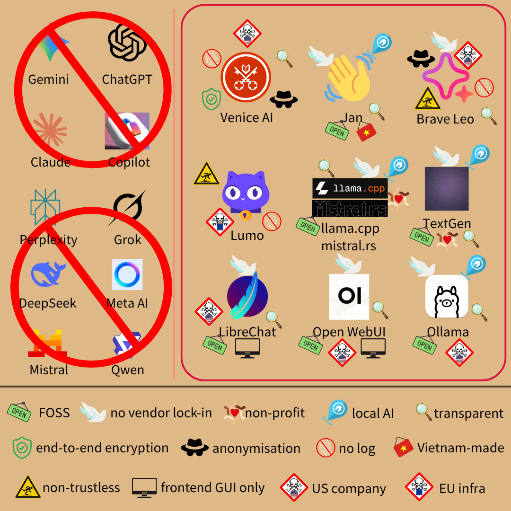

# deGoogle Gemini (和 GPT 等聊天夥伴)  

> 你的隱私，由你掌控  

那是 OpenAI 消費者隱私權[頁面](https://openai.com/zh-Hant/consumer-privacy/)的標語，不錯的笑話  
_# 這篇是要換的是聊天夥伴，不包含程式碼工具、周邊代理人生態系_  

### 看圖說故事  
  
FOSS 指「免費開源軟體」，此處標準為「隱私關鍵部分」開源  
non-profit 指「不以營利為目的」  

### 懶人包  
* 線上服務  
    * 想要端對端加密和言論、生圖自由 → [Venice AI](https://venice.ai/)  
    * 本來就在用 Brave 瀏覽器 → [Brave Leo](https://brave.com/leo/)  
    * Proton 粉絲~~，喜歡廣告不實的產品~~ → [Lumo](https://lumo.proton.me/)  
* 地端 AI  
    * 一般大眾：  
        * 追求簡單易用 → [Jan](https://www.jan.ai/)  
        * 考慮外掛擴展功能 → [TextGen](https://github.com/oobabooga/textgen)  
    * 開發者：  
        * 想自己接介面 → [LibreChat](https://www.librechat.ai/) / [Open WebUI](https://openwebui.com/) + 以下擇一  
        * 效率至上 → [Llama.cpp](https://llama.app/)  
        * 喜歡 Rust → [Mistral.rs](https://github.com/ericlbuehler/mistral.rs)  
        * 偏好簡易方案 → [Ollama](https://ollama.com/)  

### 為什麼該換  
#### Gemini、ChatGPT、Grok  
2026 年初，Google (Gemini)、OpenAI (ChatGPT)、xAI (Grok)和美國政府[達成協議](https://www.nbcnews.com/tech/tech-news/trump-bans-anthropic-government-use-rcna261055)  
提供政府尤其戰爭部「不受限的使用權」，用於武器化和監控大眾，因此[各賺 2 億美元](https://www.bbc.com/news/articles/cjrq1vwe73po)  
換句話說，除了公司會看到你的對話，政府也會用來監控  
_# 約都簽了，應該不用更多替換理由_  

#### Copilot  
微軟則是[強行綑綁](https://www.computerworld.com/article/2140187/microsoft-makes-windows-recall-opt-in-after-privacy-security-backlash.html) Copilot 和 Windows Recall 塞給~~盤子~~使用者，消費者巨大反彈下才撤回，改採「自願加入」制  
_# Recall 簡言之就是每 20 秒截圖你的螢幕，拿來「改善服務」_  
除了拿資料來練模型、和廣告商等[第三方](https://www.zdnet.com/article/best-and-worst-ai-for-your-privacy-ranked/)共享，還會**跟資料仲介 (data broker)[買個資](https://blog.incogni.com/gen-ai-llm-privacy-ranking-2026/)**  
做一堆骯髒事引來罵名後，微軟 AI 部主管還[發文](https://www.pcmag.com/news/microsoft-exec-asks-why-arent-more-people-impressed-with-ai)說不懂為什麼人們不喜歡 AI  
_# 很想跟他說「就算喜歡 AI 的人，也不會選你家 AI」_  

#### Meta AI  
和 Gemini 一樣，會[蒐集](https://9to5mac.com/2026/03/25/ai-chatbot-privacy-ratings-for-the-most-popular-iphone-apps/)包括財務狀況、種族、性取向、懷孕或生育、身心障礙、宗教或哲學信仰、工會會員資格、政治觀點、基因資訊或生物識別等資料  
對話紀錄包括文字、圖片，預設都會用來[練模型](https://www.axios.com/2026/08/17/secrets-share-ai-openai-meta-google-anthropic)、[推個人化廣告](https://www.axios.com/2026/08/17/secrets-share-ai-openai-meta-google-anthropic)  
資安更是糟糕  
搜刮資料卻不妥善保存，曾發生[聊天資訊外洩](https://alternativeto.net/news/2025/6/hundreds-of-private-chats-are-being-exposed-in-meta-ai-s-new-app-amid-major-privacy-flaw/)，你和 AI ~~見不得人的~~對話意外全公開  
Meta AI 客服只要用 VPN 翻到該用戶大略位置再請 AI 協助，就能**取得別人的帳號**  
受害者眾多，官方卻沒積極應對，直到[歐巴馬](https://www.theguardian.com/technology/2026/jun/01/meta-ai-hack-obama-sephora-instagram)等知名人物也被盜帳，才正視問題  
_# 省省吧，此漏洞已修補_  
再說 Meta [劣跡](./deMeta-macroblog.md)[罄竹難書](./deMeta-messenger.md)，看名字就知道要換  

#### Perplexity  
除了資料預設會拿來練 AI，也會用 cookies、pixel (網路指紋手段)追蹤用戶  
而且會和第三方共享、推送個人化廣告，但沒指名第三方是誰  
甚至和微軟一樣，會從其他公司、公開資料、社群、合作夥伴取得使用者資訊  
這可不是陰謀論、東窗事發，是官方[隱私政策](https://www.perplexity.ai/hub/legal/privacy-notice)自己闡明  

#### Claude  
背後公司 Anthropic *曾經*很有骨氣，[拒絕](https://www.anthropic.com/news/statement-department-of-war)美國政府、戰爭部的監控和殺戮鏈邀約  
選擇人權而非 [2 億美元](https://www.eff.org/deeplinks/2026/03/anthropic-dod-conflict-privacy-protections-shouldnt-depend-decisions-few-powerful)利益，因此獲得用戶大舉進駐，超車 OpenAI 的營收規模  
_# 不過有不少營收來自企業、開發者高額訂閱_  
但那些事蹟和隱私保障沒太大關係，頂多達到最低標準而已  
[2026 年初](https://www.anthropic.com/legal/archive/d254257b-3920-4d8c-842d-b193c7372ba9)隱私政策[更新](https://www.anthropic.com/legal/privacy)後，公司為自己擴了不少權  
1. 配合政府  
    從前只在收到法院傳票時，才會和主管機關分享資料  
    新版則讓 Anthropic「善意信念」評估後，就能**主動**向當局揭露用戶個資  
2. 身份驗證  
    官方表明，特定服務可能會要求實名制驗證  
    和這陣子的[狂潮](./online-kyc-origin.md)一樣，索取政府 ID、可能還要臉照，重點是驗證服務商為 [Persona](https://support.claude.com/en/articles/14328960-identity-verification-on-claude)  
    _# 壞消息：Persona 就是[外洩](./deMeta-messenger.md) Discord 實名制個資的公司_  
    說法當然是防濫用，但你什麼時候會遇到，沒人知道  
3. 研究、改善服務  
    Anthropic 可拿對話紀錄、用戶回饋來研究及改善模型  
    就算勾選拒絕，只要被判定對話可能違規，官方一樣有權審查、研究、用於改善服務  
    「從第三方獲取個資」這點，Anthropic 同樣淪陷了  

更誇張的是，上述規定**溯及既往**  
所以只要你用過 Claude，就算之後停用，還是會自動「被同意」那些新政策  
此外，2026 年和政府發生爭端前，Anthropic 就與資料仲介 (data broker)Palantir [合作](https://fedscoop.com/palantir-anthropic-google-government-ai-claude-partnership/)  
這層[夥伴關係](https://www.businesswire.com/news/home/20241107699415/en/Anthropic-and-Palantir-Partner-to-Bring-Claude-AI-Models-to-AWS-for-U.S.-Government-Intelligence-and-Defense-Operations)，顯然和他們提倡的「人權」背道而馳  
_# Palantir 是新型 data broker，整合民眾個資並建立可輕鬆查詢的系統  
[美國政府](https://www.eff.org/deeplinks/2026/01/report-ice-using-palantir-tool-feeds-medicaid-data)是主要客戶之一，**直接**助長政府[監控](https://www.amnestyusa.org/press-releases/usa-global-tech-made-by-palantir-and-babel-street-pose-surveillance-threats-to-pro-palestine-student-protestors-migrants/)  
Palantir 很會洗地，雖然他們和傳統資料仲介不同，但一樣剝削人們隱私_  

Anthropic 就像 AI 世界的蘋果，比競爭者**稍微**隱私友善，但也僅止於稍微  
_# 這段篇幅較多，是為了避免讀者有「Anthropic 尊重隱私」的誤解_  

#### Qwen、DeepSeek 等中國服務  
_# 這裡指官方服務，把開源模型拉下來自己跑不在此限_  
如 [DeepSeek](https://cdn.deepseek.com/policies/en-US/deepseek-privacy-policy.html) 隱私政策所述，資料全數存在中國，該國政府能[要求存取](https://anonyome.com/knowledge-center/ai-privacy/deepseek-privacy/)  
阿里巴巴 (Qwen)、Zai、Kimi 等大同小異，都會面臨[政府索資](./chinese-service-risk.md)的風險  
DeepSeek 還會蒐集[打字頻率和模式](https://dontlooksecurity.substack.com/p/reviewing-deepseeks-privacy-policy)、Qwen 會和集團公司共享資料 (且資料保存期限、分享對象、蒐集項目都相對模糊)  
想用那些模型，最好選第三方供應商或自行架設  

#### Mistral  
法國 AI 公司，*號稱*遵守歐盟 GDPR，但[隱私問題](https://www.reddit.com/r/MistralAI/comments/1whxzef/mistral_doesnt_give_us_sovereignty_or_respect_our/)依然存在  
官方服務 Le Chat (現更名為 Vibe)從前相對乾淨、可選退出模型訓練  
某天開始，突然冒出 100 多個追蹤器，主要是 sentry.io、intercom.io  
cloudflareinsights.com (即 Cloudflare)則是一直都存在  
多數都是美國公司的追蹤器服務，i.e. 引入第三方來拿你資料  
_# 2026 下旬追蹤器**數量**有變少，但只是換成漸進式載入，上述品項都還在_  
和政府也有軍事[合作](https://thedefensepost.com/2026/05/29/mistral-ai-defense-customers-policy/)，目前還沒明確幫助監控的跡象，但技術上可行  

 

如果嫌上述不夠，還有更多替換理由：  
* 不防呆，**全部**公司技術上都能取得個資、對話紀錄等資訊，背後的政府當然也可以  
* Gemini、Meta AI、Copilot 和 Perplexity 會蒐集「[精確位置資訊](https://9to5mac.com/2026/03/25/ai-chatbot-privacy-ratings-for-the-most-popular-iphone-apps/)」  
* [各家](https://reports.exodus-privacy.eu.org/en/reports/com.openai.chatgpt/latest/)的手機 [App](https://reports.exodus-privacy.eu.org/en/reports/com.anthropic.claude/latest/)，幾乎都要求[過量權限](https://reports.exodus-privacy.eu.org/en/reports/ai.mistral.chat/latest/)  
* 「不拿你的資料訓練模型」只是承諾而非技術保證，再說「不練模型」不代表不能用來行銷、建檔、分享、保存、合成訓練資料...  

 

---  

 

### 替代品  
#### [Venice.ai](https://venice.ai/)  
架構非開源的美國企業，主打抗審查、保障隱私  

閉源還拿出來講，找死！？  

別激動，因為有很聰明的方式，能提供可驗證的隱私保障  
Venice.ai 的後端主要是 NEAR AI 和 Phala Network，兩者都提供 TEE  
_# TEE 指可信執行環境 (Trusted Execution Environment)，在硬體層級提供密碼學驗證  
可從遠端驗證內部程式碼、模型權重是否受篡改_  
架構像是：  
    你的輸入 → Venice.ai 代理伺服器 → TEE  
    模型運算結果 → Venice.ai 代理伺服器 → 你  
    Venice.ai 是電信局，幫你和~~外遇對象~~模型供應商互通有無  
純 TEE 只確保服務供應者沒偷換模型，不過 TEE 能疊加端對端加密 (E2EE)  
端對端加密可最小化對廠商的信任，就算 Venice.ai 想偷看也只會讀到亂碼  

---  

Venice.ai 端對端加密流程 (沒興趣者可略)  
1. 客戶端發送請求到代理伺服器，過程除了標準 HTTPS 還會經額外加密，Venice.ai 只能看到亂碼  
    _# 加密鏈：ECDH → HKDF → AES-256-GCM_  
2. 代理伺服器會除去可識別個人資訊 (PII)，例如 IP、帳號、session ID 等  
    雖然這段實作非開源，但因為端對端加密，最糟也只會「未匿名」  
    prompt、模型回應仍是機密，不會被使用者以外的人看到  
3. 匿名化的請求送達 GPU，在 TEE 孤島內解密、計算答覆，重新加密後傳出  
    回答在客戶端才解密，代理伺服器一樣無法窺探  
    GPU 完成計算、送出回答後就拋棄資料，是可驗證的零資料保留 (Zero Data Retention)  

結果即：內容只有你和模型能看到，而 GPU 運算後就拋棄資料，無法被硬體擁有者、Venice.ai 存取，所以實際上只有你自己會讀到明碼  

---  

不只語言模型，生成圖片、影片的 AI 模型 Venice.ai 也都有  
更棒的是，語言、圖片模型沒有站方的文字獄  
平台支援多元方式付款，例如信用卡、虛擬貨幣，用以最大化抗審查  
_# 不然 [Visa](https://www.polygon.com/news/616835/visa-mastercard-steam-itchio-campaign-adult-games/)、[Mastercard](https://kotaku.com/steam-itch-io-sex-game-nsfw-censor-visa-mastercard-1851787281) 等公司，常用「斷金流」手斷到處行使[言論審查](https://www.theguardian.com/world/2025/jul/29/mastercard-visa-backlash-adult-games-removed-online-stores-steam-itchio-ntwnfb)_  

缺點：  
* 免費版有原生內容審查，付費才會取得全部自由  
    付費也只有開源模型能抗審查，閉源模型得看供應商臉色  
* 並非所有模型都支援端對端加密、預設開啟，用之前要看清楚  
* 只有 TEE、端對端加密能驗證，除去 PII 的步驟須信任 Venice.ai  
* 閉源模型如 GPT、Claude 等不適用 TEE 和端對端加密，因為後端在 OpenAI、Anthropic 這類~~邪惡~~公司家裡  
* 線上服務有 Cloudflare 當中間人  
    好處是，有端對端加密就不怕被偷窺  

Venice.ai 有自己的區塊鏈和虛擬貨幣，可以靠質押獲得獎勵、省訂閱費  

 

#### [Brave Leo](https://brave.com/leo/)  
Brave 瀏覽器內建的 AI 助手，前端[開源](https://github.com/brave/brave-browser/wiki/Brave-Leo)、但關鍵隱私架構**目前**仍閉源  
免費版可日常使用，付費享有更多額度、更好的模型  
付款後會配發一組隨機號碼，憑該碼使用付費服務  
_# 這樣就不用綁帳號、個資_  
架構如下：  
    你的輸入 → Brave 代理伺服器 → 語言模型  
    模型運算結果 → Brave 代理伺服器 → 你  
多數模型含 Claude 都[架在](https://support.brave.app/hc/en-us/articles/26727364100493-What-are-the-differences-between-Leo-s-AI-Models) Brave 自家設施上，少數由 NEAR AI TEE 供應  
聊天記錄儲存在瀏覽器裡，發送請求時才傳到 Brave 伺服器  
Brave 伺服器去除可識別個人資料 (PII)，所以模型不知道誰在發問，只知道「有人」在發問  
對話零資料保留 (zero data retention)，計算完回覆就拋棄  
看起來很理想，但並非零信任，因為 Brave 代理伺服器閉源、**無**端對端加密  
自家架模型的設施也不開源，無法判斷隱私政策是否落實  
即使 NEAR AI TEE，回傳的密碼學資訊也靠 Brave 伺服器驗證，並非你的瀏覽器  
_# 官方[說](https://brave.com/blog/browser-ai-tee/)現在是 stage 1，未來會把驗證往瀏覽器端移動，i.e. 由用戶驗證_  
換句話說，你得信任 Brave 不會偷窺、有落實隱私政策、 TEE 驗證結果可靠  
何況沒端對端加密，技術上官方能解碼內容  
_# 不過使用者可自備 API key 或用地端模型，這樣就不必信任 Brave_  

缺點：  
* 有輕微安全柵欄，模型可能拒答「有害內容」  
    如果選 Claude 則審查嚴重，畢竟是 Anthropic 的產品  
* 非零信任，關鍵部分非開源  
    就看官方何時會進入下一階段，把 TEE 驗證搬到瀏覽器裡  
* **沒**端對端加密  
* 目前僅少數模型有 TEE  
* 美國企業，受制美國政府、有監控風險  
* [Brave 瀏覽器](https://brave.com/)才能使用  
    好處是瀏覽器開源、保護隱私  

[Brave Nightly](https://brave.com/download-nightly/) (測試版)支援 AI 自動瀏覽，有興趣可玩玩  

 

#### [Lumo](https://lumo.proton.me/)  
隱私服務公司 Proton 的 AI 產品，前端[開源](https://github.com/ProtonLumo)  
[架構](https://proton.me/blog/lumo-security-model)像：  
    使用者 → Proton 後端 → 語言模型伺服器  
    語言模型伺服器 → Proton 後端 → 使用者  
除了用戶端程式碼外，剩下的都**閉源、由 Proton 掌控**  
_# 本系列其他文章對 Proton 讚譽有加，但 Lumo 可說是他們最糟的產品_  
語言模型伺服器會將 PGP 公鑰昭告天下，用戶訊息發送前，先 AES 後 PGP 加密才寄出  
訊息送達後端時，Proton 只會看到密文，但轉發給語言模型時會**解密成明文**  
語言模型運算完重新加密後才回傳，對話資訊也隨即拋棄  
問題來了，語言模型伺服器不開源、非 TEE、無法驗證、由 Proton 持有  
從「Proton 的後端」變成「另一個 Proton 的後端」，實質上沒太大差別  
換句話說，沒技術上的防呆機制，官方想解密、取資料，理論上能做到  

缺點：  
* **未**匿名化  
* **沒**端對端加密  
* **非**零信任  
* 極度不透明  
    * 宣稱使用開源模型、也給了個[清單](https://proton.me/support/lumo-privacy)，Lumo 介面卻沒蛛絲馬跡  
        使用者無從得知在用哪個模型，也沒辦法自行選擇  
        官方給模型取了[新名字](https://proton.me/support/lumo-models)，但背後是用別人的模型  
        不是故意設計得不透明、就是有另行微調過  
        Proton 未曾釋出任何模型權重，若執行了微調，等同使用自家**閉源**模型  
        _# 截稿日為止，世上沒任何一個開源模型叫 Lumo Lite、Lumo Max_  
    * 搜尋引擎安全性未可知  
        Lumo 有[網路搜尋](https://proton.me/blog/lumo-2)功能，但 Proton 未公開使用哪個搜尋引擎、是否為第三方  
        如果靠其他搜尋服務，則用戶的問題、檢索關鍵字都可能被第三者記錄下來  
        就算 Proton 用 no log 約束自己，也難保藏鏡人會拿那些資料做什麼  
    * 不誠實行銷  
        我曾在社群發問，官方強調 Lumo 有 zero access encryption、no log 政策  
        可是 zero access 僅「對話紀錄」享有，運算過程仍是破口  
        而政策終究只是政策，非技術保障的安全性  
        還有 Lumo 1.0、1.4、2.0 [宣稱](https://proton.me/blog/lumo-2-design)變聰明，殊不知只是換模型  
        官方四處用「開源」、「隱私」[大外宣](https://proton.me/business/blog/lumo-data-visualizations)，關鍵安全設施卻閉源、所謂開源模型也極度不透明，有誤導之嫌  
    * 架構設在歐洲  
        從前歐洲是個*表面上*尊重隱私的地區，但 2026 狂推 [Chat Control](https://www.patrick-breyer.de/en/posts/chat-control/)、[Chat Control 2.0](https://fightchatcontrol.eu/chat-control-overview)、[年齡驗證和實名制](./democracy_corruption.md)，甚至在歐盟議會否決 Chat Control 後[耍陰招](https://reptile.haus/journal/eu-chat-control-development-team-privacy-scanning-2026/)強行[通關](https://www.euronews.com/next/2026/07/10/chat-control-10-passed-the-european-parliament-through-the-back-door)  
        _# 有沒有覺得「不是表決多數贏就可以」很眼熟啊！_  
        誰知道歐洲各國政府會不會強索資料，何況 Lumo 並非零信任，等於留下後門隱憂  
* 如果沒付費，對話紀錄只保留一週  
* 生圖和文字回答，都可能被過濾「有害內容」  

話雖如此，鑑於隱私政策友善、破口不大，還是放上來  

 

---

 

接下來就是地端方案，i.e. 在自己電腦裡架 AI  
_# 別生氣，有很簡單的選項_  

#### [Jan](https://www.jan.ai/)  
珍 (？)，最簡單的地端模型方案，[開源](https://github.com/janhq/jan)、免費、支援各大電腦平台、介面友善  
自帶模型架設、互動體驗等全套服務，也可接 API 使用外部模型  
_# API 不綁定供應商，愛用誰家都可以_  
官方有微調[一些小模型](https://huggingface.co/janhq)，主要對問答、遵從指示優化  
下載後開箱即用，適合新手上路  
主要開發者是越南人，除了官方 API 外似乎沒商業模式  

缺點：  
* 進階功能如 RAG、長期記憶等，通常不會立刻跟上潮流  

還沒找到其他缺點，而且開發者們很友善，有 bug、想要的功能都可以直接反映  

 

#### [TextGen](https://github.com/oobabooga/textgen)  
跨平台、開源、親民的 AI 聊天 app  
除了支援多種後端、語言模型 API、能做微調，也可以接圖像生成模型  
使用難度低，基本上[下載](https://github.com/oobabooga/textgen/releases)、解壓縮就完成了  
有保留擴展性給[外掛](https://github.com/oobabooga/textgen/wiki/07-%E2%80%90-Extensions)，想加新功能也行  

缺點：  
* 維護頻率較低  
    畢竟是社群專案，開發者有空才會處理  
_# 作者也活躍在 [unsloth](https://github.com/unslothai/unsloth) 專案，算很積極的開發者_  

#### [Llama.cpp](https://llama.app/) 和 [Mistral.rs](https://github.com/ericlbuehler/mistral.rs)  
說到散戶架設語言模型，就不得不提 Llama.cpp  
社群驅動的[開源](https://github.com/ggml-org/llama.cpp)專案，開發者們創立 [ggml](https://github.com/ggml-org)，致力於 AI 邊緣推論  
從無到有以 C++ 寫成的引擎，效率絕佳，許多專案都拿來當後端  
_# 例如 TextGen、從前的 Ollama_  
普通消費級電腦就能跑，也可以靠 GPU 加速  
_# 好消息，蘋果 Metal 也是首要支援對象_  
開源模型都能架，除了當 API 後端，也可以從瀏覽器造訪本地 8080 port 開始對話  
技術文件很齊全、學習資源多，量化等基礎功能都沒少，可說是本地推論的代名詞  

缺點：  
* ggml 被美企 Hugging Face 收購、創辦人也加入該公司  
    不過 Hugging Face 是開源 AI 平台，致力於推動開放生態系  
    且 Llama.cpp 沒導入任何商業模式，目前幾乎還是慈善事業  
    2026 Hugging Face 將併入 Nvidia，如果會維持開放性，可能就不算缺點  
* 都靠指令操作，對大眾可能沒那麼友善  

Mistral.rs 和 Llama.cpp 大同小異，只是由不同開發者所建，連取名都用相似邏輯  
_# Mistral.rs 用 Rust 寫成，主打「彈性」而非「效率」_  
截稿前還是社群專案，維護者也比較少  

#### [Ollama](https://ollama.com/)  
同名公司擁有的[開源](https://github.com/ollama/ollama)專案，能架語言模型 API、也有官方雲端服務、內建對話介面  
_# 雲端要錢、非開源，不在本篇講述範圍內_  
支援各平台、多數開源模型，開發者們很活躍、學習資源也多  

缺點：  
* 推論 (inference)效率較差，產 token 速度慢  
從前推論引擎是 Llama.cpp，後來自行改寫，但以 Go 為主的框架有先天效能瓶頸  
* 靠指令操作，對大眾不那麼友善  

*據說*是簡單的本地方案，但效率比 Llama.cpp 低、沒 Jan 親民  
專案本身沒什麼問題，只是個人找不到好理由用它  

 

---  

 

本地和雲端服務都有了，接下來只是不同使用者介面，~~以防上述太醜用不習慣~~  
#### [LibreChat](https://www.librechat.ai/)  
從前是社群[開源](https://github.com/danny-avila/LibreChat)專案，提供統一聊天介面，可以自由串接 API  
_# 介面非常像 ChatGPT，從 OpenAI 搬家的轉換成本不高_  
2026 年由美商 ClickHouse [收購](https://clickhouse.com/blog/librechat-open-source-agentic-data-stack)，截稿前仍開源、積極維護  
_# ClickHouse 由俄商 Yandex 開發釋出，和[阿里巴巴](https://clickhouse.com/blog/clickhouse-and-alibaba-cloud-revolutionizing-data-analytics-in-china)雲端合作，總部在美國_  
可以自架 API 後端或用任何你習慣的服務，接到 LibreChat 進行對話  

缺點：  
* 美企持有  
    好處是開源，有問題都能發現  

 

#### [Open WebUI](https://openwebui.com/)  
美企擁有的[開源](https://github.com/open-webui/open-webui)前端介面，需要自己找後端 API  
開發者基數大、維護也算積極，但商用有特別規範，不是傳統的真開源  

缺點：  
* 美企持有  
至少開源降低了不少風險  
* 非真開源  
    大規模商用、改品牌名稱都有限制，除非另外簽企業合約 i.e. 付錢  
* 貢獻者須簽署 [CLA](https://raw.githubusercontent.com/open-webui/open-webui/refs/heads/main/CONTRIBUTOR_LICENSE_AGREEMENT)，授權 Open WebUI 拿你的程式碼做任何事  
    要求讓渡權利卻沒全開源，不是很符合開源精神  

 

---  

 

### 漏網之魚  
#### [Chutes.ai](https://chutes.ai/)  
[開源](https://github.com/chutesai)、去中心化的 AI 網路，可訂閱也可按用量計費  
對使用者來說，和一般 AI 服務沒太大差別  
不過後面沒有一個「公司實體」，而是區塊鏈自動運作  
有 GPU 的人都能架設節點加入，強制參與者使用 TEE 確保服務完整性  
供應 GPU / 模型的人，可獲得虛擬貨幣回饋，即「靠 GPU 架模型來[挖礦](https://github.com/chutesai/chutes-miner)」  
抗審查、安全、也因競價機制通常比主流服務更便宜  

那怎麼沒推薦？  

跟 NEAR AI、Phala Network 一樣，Chutes.ai **沒**免費方案，不符合 FOSS 條件  
_# 如果你願意付錢，那就沒差_  

#### [NEAR AI](https://near.ai/)  
NEAR AI 提供一般推論服務、GPU 出租  
且後端使用 TEE，是 Brave Leo、Venice AI 的供應商  
#### [Phala Network](https://phala.com/)  
Phala Network 也用 TEE、是 Venice.ai 的供應商  
半去中心化，想加入挖礦須經官方團隊審核  

如果接受付費服務，上述三個也都提供隱私保障  
Chutes.ai 去中心化最徹底，Phala 只做一半、NEAR AI 沒開放散戶加入  

Duck.ai  
知名隱私服務商 [DuckDuckGo](./deGoogle-search-engine.md) 的 AI 服務，免費用量還算多，也可付費升級  
提供 GPT、Claude、Mistral、Gemma 等多種模型，不需登入就能用  
DuckDuckGo 作代理伺服器，除去可辨識個資再送到 AI 供應商後端  
沒推薦是因為**整個架構閉源**，隱私完全寄託在對 DuckDuckGo、模型商的信任上  
GPT、Claude 等閉源模型綁定 OpenAI 和 Anthropic，開源模型則由 Together AI 提供  
所以  
1. 須信任 DuckDuckGo 會匿名化使用者個資  
2. 須信任 OpenAI / Anthropic / Together AI 不會保留紀錄、不拿來練模型  

所有參與者都是**美國公司**、**全架構閉源**，唯一比官方服務好的地方，就只有 DuckDuckGo 的信譽  

LM Studio  
有玩開源的人，應該很期待看到這東西  
但很可惜，**LM Studio 非開源**  
[程式碼倉庫](https://github.com/lmstudio-ai)只有部分組件開源，不符合 FOSS 條件  

 

---

 

目前還沒有很完美的選擇，就看未來會不會有新挑戰者  

