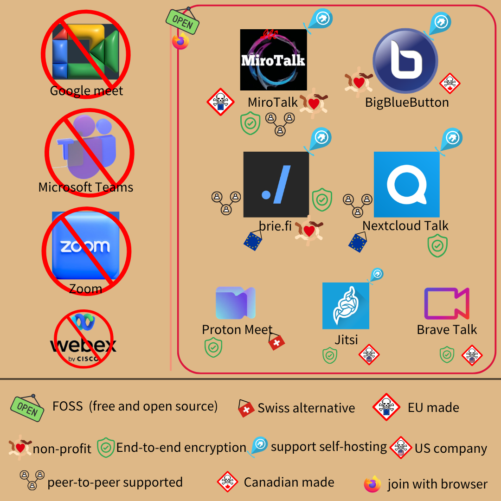

# deGoogle - 替換會議軟體  

> 我們用 Zoom 面試，到時候記得上線  

線上會議軟體，主流莫過於 Google Meet、Cisco Webex、Microsoft Teams 和 Zoom  
但此類軟體，全都有[隱私缺陷](https://www.consumerreports.org/electronics-computers/video-conferencing-services/videoconferencing-privacy-issues-google-microsoft-webex-a7383469308/)  

#### 先看圖再說  
  
製圖：移幣 aka 我  
FOSS 指免費開源軟體 (Free and Open Source Software)  
non-profit 指不以營利為目的  

### 欠換產品  
#### Google Meet  
這就不用提了，Google Meet 無端對端加密，官方能取得會議資料  
會儲存[地理位置](https://support.google.com/meet/answer/10382037?hl=en)，IP、參與者名單、通話時長等 [metadata](https://support.google.com/meet/answer/9852160?hl=en)，近期搜尋的[聯絡人](https://support.google.com/a/answer/7582940?hl=en)也會記錄  
且 Google [素行不良](https://cybernews.com/security/billions-credentials-exposed-infostealers-data-leak/)、服務又不開源，難道它講什麼我們就信什麼？  
_# 詐騙都沒那麼容易取信_  
#### Microsoft Teams  
微軟不遑多讓，預設蒐集用戶[影像、音訊](https://www.theguardian.com/australia-news/2025/may/19/nsw-education-department-caught-unaware-after-microsoft-teams-began-collecting-students-biometric-data)  
Metadata [幾乎全拿](https://www.mozillafoundation.org/en/privacynotincluded/teams/)，用於廣告行銷、和夥伴 (e.g. Meta)共用  
_# 還會結合第三方來源，取得你沒給的資料_  
對「資料如何用於 AI」也很不透明，是否以之訓練模型很難說  
微軟的[劣跡](https://www.virtru.com/blog/industry-updates/microsoft-data-breaches-2025)和 Google 同個等級，難道還不換？  
#### Zoom  
這就[更精彩](https://www.ithome.com.tw/news/137076)了  
Google 是官方會濫用個資，微軟更會分給合作者  
Zoom 則是除了**自己拿，還附贈一堆漏洞，毫無安全性可言**  
* 惡名昭彰的 [Zoom bombing](https://www.cbc.ca/news/science/zoombombing-fbi-warning-1.5519024) (Zoom 炸彈攻擊)，指未經授權的使用者亂入會議  
    不速之客能劫持更高權限，恣意踢出與會人、播放各種惡意內容  
* 安裝檔未經授權就會在背景運作、允許惡意程式碼注入 (故[被台灣政府禁用](https://www.ithome.com.tw/news/136851))  
_# 台灣[非特例](https://www.washingtonpost.com/education/2020/04/04/school-districts-including-new-york-citys-start-banning-zoom-because-online-security-issues/)，[美國](https://stuyspec.com/article/zoom-banned-due-to-privacy-concerns)、[德國](https://www.mlex.com/mlex/articles/2143442/teams-and-zoom-banned-from-schools-in-german-state-hesse)等多方，都有學校、[各級機關](https://www.reuters.com/article/us-spacex-zoom-video-commn/elon-musks-spacex-bans-zoom-over-privacy-concerns-memo-idUSKBN21J71H/)禁用 Zoom 的[案例](https://www.buzzfeednews.com/article/pranavdixit/google-bans-zoom)_  

---

_事件說明，可略_  
技術上來說，Zoom 繞過 Safari 安全網，暗地[埋設後門](https://www.howtogeek.com/427964/how-to-see-if-zoom-is-running-a-secret-web-server-on-your-mac-and-remove-it/)  
在 Mac 下載 Zoom 並執行時，會一併在背景啟動 localhost server (本地伺服器)  
瀏覽網頁時，若有 iframe 嵌入 Zoom，且裝置相機未鎖定  
鏡頭就會被自動打開、同時將你[拖入會議](https://appleinsider.com/articles/19/07/10/apple-removes-zoom-web-server-in-stealth-mac-update)  
不僅如此，**即使拆除 Zoom 應用程式，本地伺服器仍會存在**  
甚至**在背景「偷偷裝回」Zoom**，簡直就是惡意軟體  
連蘋果都罕見[採取行動](https://techcrunch.com/2019/07/10/apple-silent-update-zoom-app/)，發佈自動更新將 Zoom 背景伺服器拆除  
_# 此類更新會自動下載，用戶毋需做任何事，以往多用於排除惡意軟體_  

---  

* 當然，用個資搞廣告、和第三方分享，他們[也沒少做](https://www.reco.ai/hub/zoom-privacy-issues#:~:text=Zoom%20has%20also%20faced%20issues%20with%20its,can%20be%20exploited%20if%20not%20carefully%20managed.)  
* Zoom 曾號稱端對端加密，結果被發現只加密聊天室，會議本體[未落實](https://proton.me/blog/zoom-85-million-settlement)  
    加上未經用戶同意就[與 Google、Facebook 分享資料](https://arstechnica.com/tech-policy/2021/08/zoom-to-pay-85m-for-lying-about-encryption-and-sending-data-to-facebook-and-google/)，賠上 8500 萬美元  
* 原本說用 AES 256 做加密，卻[被踢爆](https://citizenlab.ca/2020/04/move-fast-roll-your-own-crypto-a-quick-look-at-the-confidentiality-of-zoom-meetings/)只用 AES 128，**公然謊言行銷**  
    簡單說就是加密金鑰強度差異，但資安為「非黑即白」  
    「強度不足易被破解」形同沒做，就像關了家門卻沒鎖上  
    你說「我有關門哪！」，東西就被偷了誰管你有沒有關門？  
    更糟的是，此舉誤導用戶產生「安全的錯覺」，可能致使機敏資料流出  
    即「你以為門鎖了，所以把鑽戒、金條放桌上」，徒增被盜風險  
    若你知道門沒鎖，貴重物品還會亂放嗎？  

值得一提的是，Zoom 雖於美國上市，但在中國有三間公司、700 多位員工  
部分伺服器設於中國，也曾將資料[送中](https://citizenlab.ca/2020/04/move-fast-roll-your-own-crypto-a-quick-look-at-the-confidentiality-of-zoom-meetings/)  
簡言之，就是[美皮中骨](https://citizenlab.ca/2020/04/move-fast-roll-your-own-crypto-a-quick-look-at-the-confidentiality-of-zoom-meetings/)的假面公司  
若美國政府要求，Zoom 會[配合](https://www.theverge.com/2020/6/3/21279355/zoom-end-encryption-calls-fbi-police-free-users)交出用戶資料  
_# I.e. 貼心提醒，[稜鏡計劃](https://tw.news.yahoo.com/%E4%BB%80%E9%BA%BC%E6%98%AF%E7%BE%8E%E5%9C%8B%E7%9A%84prism-%E7%A8%9C%E9%8F%A1%E8%A8%88%E7%95%AB-%E9%80%99%E6%98%AF%E7%8F%BE%E4%BB%8A%E5%B8%B8%E4%B8%8A%E7%B6%B2%E8%B7%AF-%E3%80%81-%E5%B8%B8%E7%94%A8%E6%89%8B%E6%A9%9F%E7%9A%84%E6%88%91%E5%80%91%E6%87%89%E8%A9%B2%E8%A6%81%E4%BA%86%E8%A7%A3%E4%B8%80%E4%B8%8B%E7%9A%84%E7%BE%8E%E5%9C%8B%E6%9C%80%E9%AB%98%E6%A9%9F%E5%AF%86%E7%9B%A3%E8%81%BD%E8%A8%88%E7%95%AB-132129828.html)就是**美國**國安局伸髒手進**美國企業**搞的_  
中國政府也能干涉，例如[停止 64 學運領袖帳號](https://cn.nytimes.com/technology/20200612/zoom-china-tiananmen-square/zh-hant/)  
**Zoom 是家「結合中資、美帝一切缺點的公司」，厲不厲害呀？**  
軟體安全性漏洞，說是無心之過也罷  
誤導行銷、政治干預、個資濫用、後門埋設...，顯然是蓄意為之  
如此惡質的公司，能不換嗎？  
#### Cisco Webex  
Cisco (思科)同樣是美商，收購 Webex 後維運該服務  
隱私政策稱不上透明，卻很愛用「安全」、「隱私」當[行銷口號](https://help.webex.com/en-us/article/nv2hm53/Webex-Security-and-Privacy)  
蒐集哪些資料、metadata，拿個資來[做什麼](https://privacy.commonsense.org/privacy-report/Cisco-Webex)、與誰分享，都[不清楚](https://www.consumerreports.org/media-room/press-releases/2020/05/cisco-clarifies-privacy-policy-for-webex-videoconferencing-after-cr-study/)  
Cisco Webex 也出過[安全性漏洞](https://www.techzine.eu/blogs/privacy-compliance/120809/sensitive-metadata-cisco-webex-was-childs-play-to-find-but-how/)，[瀏覽器外掛](https://compciti.com/news-release-cisco-webex-security-issue/)、[亂入訪客](https://www.securityweek.com/cisco-webex-vulnerability-exploited-join-meetings-without-password/)、[ID 保護](https://www.grcworldforums.com/privacy-and-technology/vulnerability-found-within-cisco-webex-and-zoom/75.article)...  
~~所以才叫「Cisco Webex，思科 - 違背個資」~~  
雖沒 Zoom 嚴重，漏洞也多已修復  
看在不透明隱私政策、非開源、美企的份上，仍該換一下  

怎沒提蘋果 Facetime？  

Apple 也是美企，但預設端對端加密、蒐集有限度 metadata  
_# Metadata 包括如何時通話、通話多久等_  
官方隱私政策說明，最多保留 30 天  
不值得推薦，但也沒到欠換的程度  
_# 果粉可以歡呼了_  

### 替代品們  
#### [MiroTalk](https://p2p.mirotalk.com/newcall)  
MiroTalk 是社群自發建立的專案，開源、重隱私，且**無須下載 app**  
仰賴 WebRTC (Web Real-Time Communication)技術，用瀏覽器即可  
免帳號、免登入、免瀏覽器外掛，支援各大平台 (有瀏覽器就行)  
伺服器僅確認與會者、讓用戶得以對接，之後就採對等網路 (peer-to-peer, p2p)通訊  
簡單來說，就是伺服器當月老，幫用戶牽線便功成身退  
用戶彼此私下聯繫 (p2p)，和伺服器再無瓜葛  
因伺服器不儲存資料，媒合完資料就消失了  
_# 即 STUN server (Session Traversal Utilities for NAT)_  
通訊層加密、p2p，達成**端對端加密**  

擔心伺服器被駭怎麼辦？  

別怕，p2p 讓參與者對接後，根本沒伺服器的事  
若擔心 metadata 被儲存，可**自架伺服器**  
缺點是 p2p 靠與會者互傳資訊，人數上升時負載會暴增，較適合小型會議  
MiroTalk 作者早就想過，於是他開發了多款變體：  
_# 以下依「人數少到多」排列_  
* [MiroTalk c2c](https://c2c.mirotalk.com/) (Cam-to-Cam)：專為「一對一視訊」打造  
* [MiroTalk p2p](https://github.com/miroslavpejic85/mirotalk)：上文介紹者  
* [MiroTalk SFU](https://sfu.mirotalk.com/) (Selective Forwarding Unit)：用戶將資料傳到 SFU 伺服器，由伺服器選擇性 (selective)轉發給特定與會者  
    適合中大型會議，靠伺服器解決前述負載問題  
    _# 建構在 [Mediasoup](https://github.com/versatica/mediasoup?tab=readme-ov-file) 上，亦可直接用 [mediasoup](https://mediasoup.org/)_  
* [MiroTalk bro](https://bro.mirotalk.com/) (~~brother~~ broadcast)：由單一廣播者發訊，其餘人口僅收聽  
    廣播、單向傳遞訊息時可用  

若想靠帳號管理使用者，亦可架 [MiroTalk WEB](https://github.com/miroslavpejic85/mirotalkwebrtc) 平台以實現  
各種場景都能應對，功能十分完善  
缺點：  
* 還沒找到  

MiroTalk 也支援 iframe 嵌入網頁，對前端開發者很友善  
點擊連結、發起通話，即可使用  
夠簡單吧！  

#### [BigBlueButton](https://bigbluebutton.org/)  
BigBlueButton 直翻大藍鈕 (縮寫 BBB)，2007 年加拿大學界推出的開源專案  
開發者覺得  
> 發起線上會議，應像按下一顆藍色大按鈕一樣簡單  

[smash a blue button](bigbluebotton-meme.jpg)  
目標受眾是教學者，例如學校老師  
主要[功能](https://bigbluebutton.org/tutorials/)：  
* 線上會議  
    課堂也能算一種會議，對吧？  
* 螢幕分享  
    若無法分享螢幕，還要它幹嘛？  
* 白板  
    除了基本繪圖、擦除等功能，亦可和學生協作  
    老師能個別輔導，讓虛擬課堂更逼真  
* 分組討論室 (Breakout Rooms)  
    主持人能創建討論室，將參與者分派入小組進行協作  
    才不會所有參與者在同個空間討論，人多嘴雜互相干擾  
    且討論室內能共享筆記、白板，形同獨立小型會議  
    討論環節結束時，再將眾人拉回大會議室  
    _# 可設定討論時長，時間到由系統自動終止_  
* 私訊功能  
    可傳悄悄話給特定與會者，例如~~小情人~~同學  
* 匿名投票  
    可用於課堂互動，多選題也支援  
* 學習分析儀表板  
    不開攝影機、不時刻緊盯，仍可掌握學生參與度、學習成效  

可說是線上課程完善套組，台灣有[多所大學](https://moodletest.ncnu.edu.tw/mod/folder/view.php?id=653513)已投入使用  
_# BBB 和許多學校的線上平台「moodle」相容，可無痛整合_  
缺點：  
* 無端對端加密  
    但伺服器可自架，若機構擔心安全問題，自行維運內部服務即可  
    _# 有[其他機構](https://nlnet.nl/project/BBBsecureChat/)為 BBB 開發端對端加密，不過原始碼似乎不見了_  
* 架構龐大，稍嫌笨重  
    若只想和朋友視訊、三五人線上開會，整套系統未免太臃腫  
* 有技術門檻  

企業內部遠端會議、教育機構線上教學，不妨試試 BBB  

#### [brie.fi](https://brie.fi/ng)  
德國社群開發者創立的專案，開源、非營利，讀作 [briefing](https://github.com/holtwick/briefing/) (拆成 brie.fi/ng)  
若要衍生閉源產品，可購買白標 (一次性付 499 歐元)  
原理和 MiroTalk 幾乎一樣，靠 WebRTC 直接用瀏覽器通話  
免下載、p2p (對等網路)，伺服器可自架 (而且很簡單)  
也因對等網路、通訊層加密，達成端對端加密  
但沒擴展出其他版本，僅適合較少參與者的會議  
缺點：  
* 不適合太多人的會議 (e.g. 二三十人)  

不知為何明明設計給瀏覽器，官方卻開發了 [iOS app](https://apps.apple.com/app/briefing-video-chat/id1510803601)  
直接點[連結](https://brie.fi/ng)發起會議即可，應用程式實則多餘  

#### [Nextcloud Talk](https://nextcloud.com/talk/)  
又是老面孔，Nextcloud，下一朵雲 (？)  

---

背景簡介，~~不爽~~可略：  
受開發者歡迎的德國公司，產品 100% 開源  
Nextcloud 是整合雲端服務，類似 Google 或微軟的雲端  
有各種工具，包括文件編輯、雲端儲存、Email 收發等  
當然，也包括視訊會議服務 Nextcloud Talk  
任何人皆可自行架設，且**開源版和企業版`沒有差別`**  
_# 官方也鼓勵大眾自架服務喔！_  
商業模式為協助企業架設伺服器、排除問題等，簡言之就是賣服務  
故無隱藏費用，也不貪個資  

---

回到正題，Nextcloud Talk 是其整合服務中的一項  
同樣用 WebRTC、DTLS/SRTP 加密傳輸  
I.e. 只需瀏覽器，不必另外下載 app  
小型會議會用 p2p，伺服器僅媒合用戶 (和前述 MiroTalk、brie.fi/ng 一樣)  
_# p2p 指對等網路 (peer-to-peer)，即與會者對接，不經伺服器_  
藉傳輸層加密、p2p 達成端對端加密  
有大型會議需求的話，可裝高效後端 ([high performance backend](https://portal.nextcloud.com/article/Nextcloud-Talk/High-Performance-Backend/Installation-of-Nextcloud-Talk-High-Performance-Backend), HPB)  
_# 超過 10 人以上，可能就需要 HPB_  
由伺服器協調流量，並提供錄影、電話撥入 (類似 Google meet)功能  
且支援檔案分享、白板、投票與文字聊天等  
體驗很完整，也很安全  
但現階段文字訊息無端對端加密，會儲存在伺服器中  
_# 若自架伺服器，就不擔心資料被偷_  
  缺點：  
* 須自行架設伺服器，有技術門檻  
* 文字尚無端對端加密  
    伺服器自架則不必擔心第三方盜取  
* 小型會議才有端對端加密 (因為才是 p2p)  
    大型會議只有傳輸層加密，第三方無法介入，但伺服器擁有者能窺探  

裝置有瀏覽器就能加入會議，各大桌面平台也有 app 可下載 (非必須)  

#### [Jitsi](https://jitsi.org/)  
最知名的開源會議軟體，莫過於 Jitsi  
_# Jitsi 是保加利亞語「電線」之意_  
功能完善、支援端對端加密、伺服器[可自架](https://github.com/jitsi/jitsi-meet)，也可用[官方服務](https://meet.jit.si/)  

---

講古 (可略)：  
Jitsi 最初由獨立團隊開發， 2015 年被 Atlassian 收購，為旗下 HipChat 加入視訊功能  
但之後 Atlassian 把 HipChat、Stride 賣給 Slack，Jitsi 留著就沒用了  
於是 2018 年 8x8 買下 Jitsi，承諾維持其開源性質，因此開發者沒跑光  
從此 Jitsi 變成 8x8 的開源專案，至今仍是開源會議的首選之一  

---

Jitsi 在「一對一」視訊時，採 p2p 對等網路  
也就是伺服器僅媒合用戶，不經手視訊內容  
而傳輸層有加密，藉此達成端對端加密  
用 WebRTC 做視訊，因此瀏覽器即可加入 (和前幾者相似)  
多人會議時，則使用 Jitsi 影片橋接 (Jitsi Videobridge, JVB)  
伺服器轉發串流資訊給眾人，不會儲存經手資料  

若伺服器擁有者，惡意儲存怎麼辦？  

Jitsi 也想到了，有兩個方法可解：  
* ~~轟炸伺服器中心~~  
* 自架伺服器，總不會偷自己資料吧！  
* Chromium 83+ 的瀏覽器，可用 Insertable Streams 做端對端加密  

_# Chromium 是一種瀏覽器核心，可參考我[替換瀏覽器](./deGoogle-browser.md)一文_  
由用戶端以每場會議的共用對稱金鑰，對媒體再行加密  
確保伺服器的 Jitsi Videobridge 無法解密，只能轉發  
_# 端對端加密用 olm protocol_  
**簡言之，[Brave](https://brave.com/)、Chrome、Edge 等瀏覽器，能開啟端對端加密**  
後來**行動版應用程式，也支援端對端加密**  
_注意：端對端加密僅限影音。文字聊天、投票功能不在保護傘下  
且 20 人以上會議，端對端加密效果有限_  
缺點：  
* 用官方服務發起會議，「須以 Google、Facebook 或 Github」連動登入  
    _# Github 是程式碼託管服務，已被微軟收購，三者都不是好選擇_  
    官方說法是避免濫用，所以要求身份驗證 (i.e. 登入)  
    不然從前，隨便個誰都能濫啟會議  
    有人問過官方，能否加上 email 登入選項  
    官方強硬回絕了，所以短期內應該都不用想  
* **美國公司**，若無端對端加密則官方服務風險高  
* 只在一對一視訊時，採 p2p 達成端對端加密  
* 端對端加密僅支援 Chromium 系列瀏覽器  
    重視隱私者，只剩 [Brave](https://brave.com/zh-tw/download/)、[Bromite](https://www.bromite.org/) 等少數選擇  
    因為多數[隱私瀏覽器](./deGoogle-browser.md)，都基於 [Firefox](https://www.firefox.com/zh-TW/)  

好處是開源、可自架服務，多數問題能因此解決  
Jitsi 架構完善，不少會議服務也是從 Jitsi 衍生而來  
例如 [Calyx meet](https://calyxinstitute.org/projects/digital-services/calyx-meet) (似乎掛了)、下文介紹的 Brave Talk  
也有許多[第三方](https://meet.init7.net/en/)，架設 [Jitsi instances](https://pads.ccc.de/jitsiliste) 供大眾免費使用  
**_# 第三方是否有惡意，本篇不作任何保證_**  

#### [Brave Talk](https://talk.brave.com/)  
此 Brave 即瀏覽器的那家 Brave，他們也有會議服務  
Brave Talk 建構在 Jitsi 上，但移除了遙測  
官方[宣稱](https://brave.com/blog/brave-talk-launch/)不會儲存任何資料、metadata (e.g. 通話對象、時長等)  
支援端對端加密，但須手動開啟  
_# 端對端加密仍在測試，有時會不穩定_  
4 人以下會議免費，用瀏覽器即可加入，且不限時長  
更多人則需訂閱，畢竟他們是公司，不是非營利機構  
_# 現有 AI 新功能 [Leo](https://support.brave.app/hc/en-us/articles/25728936518285-How-to-use-Leo-with-Brave-Talk) 加入，可做會議記錄_  
缺點：  
* 美國公司  
* 免費版有人數上限 (4 人以下)  
* ~~發起會議須用 Brave 瀏覽器~~現已可用其他瀏覽器發起  
    _# 其他人可用任意瀏覽器加入_  
* 端對端加密非預設開啟，且仍為實驗功能  

鑑於 Brave Talk [開源](https://github.com/brave/brave-talk)、隱私政策友善，所以還是予以介紹  

---

### 懶人包  
選擇障礙？  
可參考以下推薦：  
* **少數**朋友私下視訊：  
    * 極簡主義、不想下載軟體 → [MiroTalk](https://p2p.mirotalk.com/newcall) / [brie.fi](https://brie.fi/ng)  
    * 開發者，有在玩 Nextcloud → [Nextcloud Talk](https://nextcloud.com/talk/)  
    * 有自己的 [Jitsi](https://jitsi.org/) 伺服器 → [Jitsi](https://jitsi.org/)  
    * 有裝 Brave 瀏覽器 → [Brave Talk](https://talk.brave.com/)  
* ~~詐團~~公司 / 機構 / 朋友**多人會議**：  
    * 能自架伺服器 → [Jitsi](https://jitsi.org/) / [Nextcloud Talk](https://nextcloud.com/talk/) / [MiroTalk SFU](https://sfu.mirotalk.com/)  
    * 若有細緻協作需求 → [BigBlueButton](https://bigbluebutton.org/)  
* 教育機構會議、**線上教學** → [BigBlueButton](https://bigbluebutton.org/)  
[MiroTalk](https://p2p.mirotalk.com/newcall)、[brie.fi](https://brie.fi/ng)、[Brave Talk](https://talk.brave.com/) 算最簡單的，進官網、點擊發起會議即可  
若無法自架伺服器，[Jitsi](https://jitsi.org/) 官方登入途徑有隱私疑慮，但操作同樣簡單  
[BigBlueButton](https://bigbluebutton.org/)、[Nextcloud Talk](https://nextcloud.com/talk/) 對一般大眾可能有點難度  

---

### 跋  
咱[葉次長](https://www.cna.com.tw/news/ahel/202512230371.aspx)曾對 Zoom 發表[高見](https://cofacts.tw/article/36r3h86c3wj7q)，他做了**不詳盡**的調查，便一路滑坡到底  
稱此「非資安問題，而是政治問題」，實則不想改變，所以只找有利觀點說服自己  
忽略 Zoom 一路不慎、受迫、甚至蓄意的惡質行為  
也完全不提威脅模式 (threat model)，即不同人、不同內容的風險殊異  
應以適當方式處理，而非全用相同手段  
_# 例如險境中的人權倡議者需要 [Tor 瀏覽器](https://www.torproject.org/download/)，一般人用 [Mullvad](https://mullvad.net/en/browser) 可能就足夠_  
葉直接宣告「線上就是不安全」，既然其他選擇也不安全，那繼續用 Zoom 也一樣  
_# 他說自己會繼續用 Zoom，問題是他所謂「其他選項」，皆為本篇屏棄者_  
如同「反正走在路上都可能被車撞，那乾脆走車道，不必特地走人行道」一樣荒謬  
_# 請問走人行道和走車道，兩者風險孰高孰低？_  

本篇揭露的資訊，顯見 Zoom 存在重大缺陷 (不論系統設計、經營理念、或政治因素)  
若評估後仍決定用 Zoom，那是你的選擇  
如果是「什麼都不知道，隨便選個用」，那連「對自己負責」都稱不上  

相信重視隱私的人，看完這篇後能做出明智的決定  

