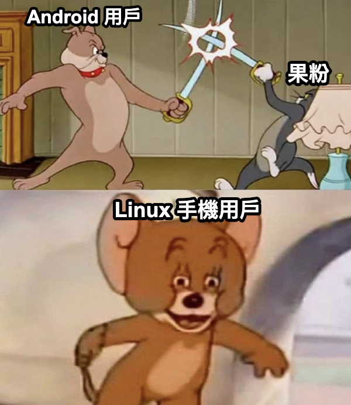
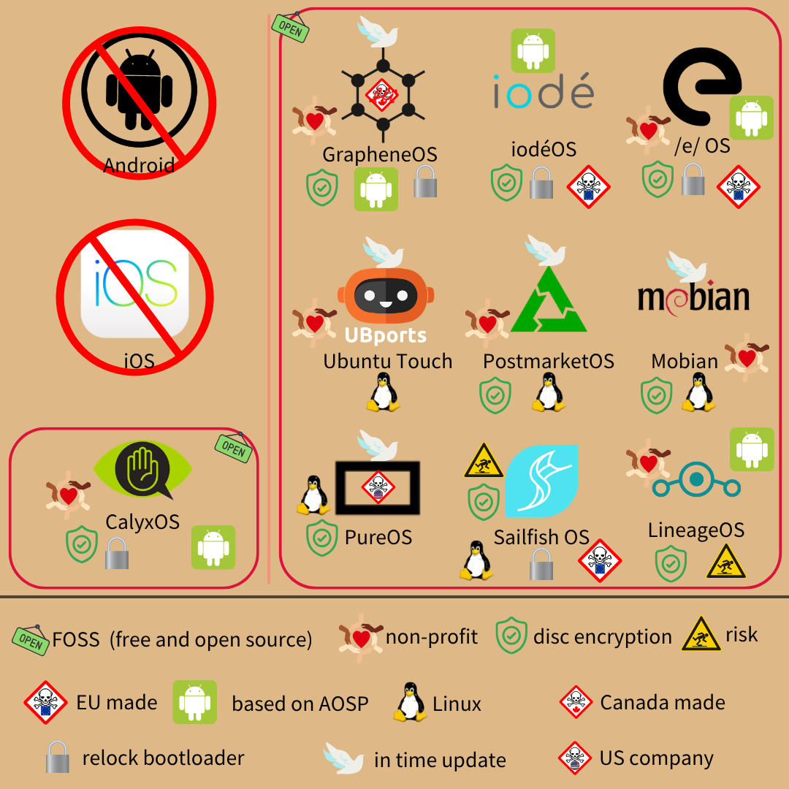

# deGoogle - 換掉 Android  

> 果黑：現在還買 iPhone 的都果盤  
> 果粉：窮底層才買 Android  

每次論壇有人問手機，總會引來兩派論戰  
彷彿不買 iPhone，就只能選 Android  
情況過於好笑，忍不住做了哏圖：  
  
雖然標題說換 Android，但本篇**不支持任何一方**  
因為兩邀都爛，都欠換！  

### ~~大膽狂~~圖  
  
FOSS 指免費開源軟體 (Free and Open Source Software)  
non-profit 指「不以營利為目的」  
in time update 指適時、及時更新  

個別深入前，先補充背景知識 (開發者可略)：  

---
  
#### ROM  
唯獨記憶體 (Read-Only Memory)，行動裝置界指手機韌體  
尤指 Android 作業系統 (Operation System)，類似桌面平台的「OS」  
_# iOS 閉源，幾乎無客製化彈性，所以通常不包含_  
而 Android 是 Google 的**開源**專案，簡稱 AOSP (Android Open Source Project)  
iOS 與 Android 幾乎二分市場，彼此時有消長  
Google 問題很多 (稍後詳述)，所以出現不少「去 Google 化」的 ROM  
本篇會介紹者，部分是從 Android 分支 (fork)而來  
畢竟開源的好處之一，即「爛就換」  
其他則是 Linux 作業系統，完全獨立於二者  
雖看似自由、理想，但 Linux 手機生存情況不樂觀  
主要有兩大原因：  
* 手機市場中，軟體也是至關重要的一環  
    OS 再棒，應用程式不好用也吸引不到人  
    _# 設想你買新手機，結果習慣的 app 通通裝不了，下次還會買它？_  
    手機軟體開發者，多已固著在 Android 和 iOS  
    公司開發新 app，通常也不會針對小眾平台  
    因此對一般用戶來說，轉換成本偏高  
* 手機設計  
    很抱歉，多數手機商的硬、韌體，都針對 Android 設計  
    所以想灌 Linux 進手機，得處理一堆相容性問題  
    iPhone 更不用說，只能裝 iOS  
    導致許多 Linux ROM「無法鎖 bootloader」，具額外風險  

#### Bootloader  
管控 OS 進入主記憶體 (RAM)的程式，重灌前須先解鎖  
Android 裝置的 bootloader 多有安全機制，防堵未授權的韌體刷入  
意思是，舊版 Android、不明 OS 不可安裝  
_# 預防駭客刷入舊版 Android，重新暴露已修補的漏洞_  
且不是每家手機商，都允許解鎖 bootloader  
例如[三星](https://sammyguru.com/breaking-samsung-removes-bootloader-unlocking-with-one-ui-8/)新款，幾乎全都無法解鎖  
不能解鎖代表無法重灌、換系統，只能繼續用原裝套組  
重灌 OS 後能否重新鎖上，也得看各家韌體設計  
Google Pixel、[Fairphone](https://www.fairphone.com/) 這類品牌，**通常**可鎖回 bootloader  

#### 刷機  
「重灌」在手機界，常稱為「刷機」(flash)  
指「安裝新的 OS 進手機」，原有資料會全洗掉  
通常遵循以下流程：  
1. 解鎖 bootloader  
2. 連接電腦，用工具刷入你要的 OS  
3. 如果可以，~~我想和妳 回到那天相～遇～~~重新鎖上 bootloader  
_# 此為簡化版，刷 OS 前請詳閱各家文件_  

---
  
枯燥的結束了  
### 開始換吧！  
#### Android  
前面說 Android 開源，那為何要換掉呢？  
嗯，Android 本身開源，但 Google 硬塞了超多自家**閉源**程式  
_# 雖開源，但主要維護者為 Google，更新都由他們出_  
和微軟一樣，市占率高就開始胡作非為  
買來 Android 新機，裡面通常包括：  
* [Google Play](./deGoogle-appStore.md)  
* [Youtube](./deGoogle-video-platform.md)  
* [Google 地圖](./deGoogle-map.md)  
* [Chrome](./deGoogle-browser.md)  
* 相機、計算機、簡訊、電話 app  
    別傻了，不少廠商直接預裝 Google 的閉源程式  
* 鍵盤 ([Gboard](./deGoogle-keyboard.md))  
* 新版還偷渡 Gemini  
_# 超連結為替換文章_  

重點是你頂多「停用」，沒辦法「解除安裝」那些數位針孔  
礙眼就算了，還佔用儲存空間  
而且有多少用戶，會替換原生程式呢？  
別忘記，那些都是隱私噩夢  

夠爛了嗎？  
還沒完呢！  

如果你姑息，Google 會[未經授權偷拿資料](https://cybermagazine.com/news/why-has-google-been-ordered-to-pay-android-users-us-314-6m)  
當 Android 手機閑置時，許多個資已暗中傳回 Google  
_# Google 因此被加州法院罰 3 億多美金_  
加上[之前提過](./deGoogle-appStore.md)，Google 準備限縮 Android 開放性  
將來恐怕只能從 Google Play 下載軟體，變成近乎蘋果的封閉體系  
屆時 Google 大概會進一步打壓，任何有競爭力的替代商店  
若真走到那步田地，本篇的替代 ROM 會是重要救星  

#### iOS  
注意：以下內容會粉碎你對蘋果「尊重隱私」的**幻想**  
首先不得不說，iOS 安全性還不錯  
應用程式都關在沙盒裡，無法任意干預其他 app  
_# 沙盒指隔離環境，像「虛擬世界中的虛擬世界」_  
第三方非法入侵、app 越權相對**罕見**  
然而，「第一方」濫權，不在防護圈內  
  
最具爭議的，莫過於 Siri  
Siri 「理論上」受關鍵詞啟動，例如「嘿 Siri」  
平時為待命狀態，不會收集用戶音訊  
不過前陣子[被發現](https://www.theguardian.com/technology/2025/jan/03/apple-siri-privacy-lawsuit-settlement)，Siri 會在背景偷錄音  
使用者毫不知情，蘋果也沒告訴過你  
_# 隱私條款也沒寫喔！_  
且[錄製](https://www.theguardian.com/technology/2019/jul/26/apple-contractors-regularly-hear-confidential-details-on-siri-recordings)的聲音，不只用於**廣告推送**，還拿去優化服務  

你以為只是自動化練 AI 嗎？  
不，他們還[人工聽取](https://www.theverge.com/2019/8/28/20836760/apple-apology-siri-audio-recordings-privacy-changes-contractors)  

只要 iPhone 在身邊，家人對話、商務機密等私人內容，都可能被聽到  
Apple 因此付出[九千五百萬美元](https://www.businessinsider.com/hey-siri-settlement-administrator-is-sending-letters-to-apple-users-2025-5)，當平息的代價  
所以才有個笑話：  
使用者：幫我打給小明  
Siri:您要先用『Siri』喚醒我  
使用者笑了、Siri 笑了，Alexa 和祖克柏也都笑了  
_# Alexa 是亞馬遜公司的智慧助手_  
一個靠「尊重隱私」當噱頭公司，居然和 Google、微軟一樣糟  
噱頭終究只是噱頭，想要隱私還請三思  
畢竟多數軟韌體閉源，外界無從審核  
尊不尊重隱私，全憑公司一張嘴  
此外，App Store 閉鎖體系、橫徵暴斂蘋果稅，都對開源社群極不友善  
_# 除了歐盟用戶，其餘果~~盤~~粉[下載軟體](./deGoogle-appStore.md)多半逃不過官方魔爪_  
還沒完，iOS 也有個 Android 的弊病 - 預載軟體拆不掉  
你不喜歡 Safari、Siri，頂多只能「關閉」  
意思是，它們沉眠於手機中，但無法直接刪除  

很嚴重嗎？  

光 Apple Intelligence，就**至少**[佔據 7GB 容量](https://lifehacker.com/tech/apple-intelligence-will-soon-need-at-least-7gb-storage-on-every-device)  
其他 app 更不用說，想清出空間都沒辦法  
> 沒用的東西堆積，只會成為累贅 - 旗木卡卡西  

還有 [VPN 問題](https://mullvad.net/en/blog/force-all-app-traffic-into-the-tunnel)  
iOS 在設計上，就對網路流量開了不少[特例](https://www.wired.com/story/apple-ios-vpn-data-leak/)  
就算你連 Wi-Fi，第三方 app 仍可存取行動網路、拿到真實 IP  
還有 Apple 自家服務，天生就是例外，包括：  
* App Store  
* Health app  
* 地圖  
* 通知推送  

即使你開 VPN、啟動 Lockdown 模式，那些 app 仍會規避 VPN 傳輸  
_# 就是 Apple 給自家軟體開後門，拿到個資比用戶安全重要啦！_  
鑑於以上問題，iOS 也該換掉  

值得一提的是，iOS 和 Android 都有全硬碟加密 (Full Disc Encryption, FDE)  
後來 Android 為了開機效率，改用逐檔加密 (File-Based Encryption, FBE)  
對外接電腦暴力破解，都有不錯的防護  

---
  
### 替代品們  
#### [GrapheneOS](https://grapheneos.org/)  
Graphene 是「石墨烯」  
以此為名，旨在彰顯輕量、堅固、獨特等性質  

---

### 替代品們  
#### [GrapheneOS](https://grapheneos.org/)  
Graphene 是「石墨烯」  
以此為名，旨在彰顯輕量、堅固、獨特等性質  

---
  
講古 (可略)：  
前身為 CopperheadOS，是營利導向的加拿大公司  
起初程式碼公開，但非開源  
_# 用 [CC BY-NC-SA 4.0](https://creativecommons.org/licenses/by-nc-sa/4.0/deed.en) 授權，開源介紹可見[前文](./open-source-intro.md)_  
2020 年起原始碼不再可檢視，變實實在在的閉源軟體  
後來由於理念相左，創辦人之一 Daniel Micay 離開公司  
他持續投入開發，2019 年定名 GrapheneOS  
2023 年成立 GrapheneOS 基金會，確保專案永續發展  

---
  
GrapheneOS 改自 AOSP (Android Open Source Project，就是 Android 啦！)  
不只顧隱私，更為「安全性」[特化](https://www.allthingssecured.com/identity-protection/android-vs-grapheneos-compared/)：  
* 強化沙盒環境，限縮應用程式權限  
    不需要的資料就無法訪問，可細緻管理  
    * 網路權限  
        能完全禁止個別 app 網路權限，包括本地網路 (localhost)  
        不連網就不怕資料外傳，簡單又非常實際  
    * 感測器權限  
        可手動調控陀螺儀、氣壓計、羅盤...等感測器的權限  
        陀螺儀能推測滑手機姿勢，氣壓計、羅盤則透露地理環境  
    * 存取範圍  
        app 能讀取的目錄、檔案，都可以控管  
    * 聯絡人  
        可僅開放特定聯絡人給 app，而非「**一旦授權就能讀取整個聯絡清單**」  
    光一個強化沙盒，就擴增了許多安全性  
* 拔光 Google 服務，連 Google Play 都沒有  
    若真的很想要，你可以在沙盒裝回 Google Play  
    它享有的權限，和一般應用程式相同，眾生平等  
    _# 一般 Android 給 Google Play 系統特權_  
* 記憶體分配器  
    使用後能立刻清除記憶體，防堵記憶體攻擊  
    _# 一般情況下就算你關分頁，駭客還是能從記憶體挖回暫存資料_  
* 預設禁止動態程式碼執行  
    避免解譯器 (interpreter)執行遠端惡意程式碼  
    瀏覽器即時渲染 (Just In Time, JIT)也禁用，同樣因安全考量  
* 系統硬體級加密  
    開發者選擇搭載 Titan M 晶片的裝置，專門對其優化  
    因此可驗證啟動 (verified boot)，也能在刷入 GrapheneOS 後重新鎖上 bootloader  
    _# 防止被刷回舊版利用漏洞_  
* Wifi 連線  
    能逐個隨機化 MAC 位址，強化 Wifi 匿蹤性  
* PIN  
    解鎖螢幕時，若總是點擊固定位置，很容易被猜出 PIN  
    Graphene 輸入介面隨機化，按鈕不固定就不易猜透  
    最多能設 128 碼，甚至支援 2FA (PIN + 指紋)  
    支援脅迫防護，輸入特定密碼就能抹除設備資料，i.e. 格式化  
    如果人身安全受威脅，輸入安全碼就沒人能拿到你的資料  
    _# E.g. 到中國旅遊被公安要挾_  
* 安全性更新  
    Graphene 安全補丁比 Google 還快，頻繁更新防堵漏洞  
    且 Android 更新時，Graphene 往往會在一天內跟上  
* 應用程式  
    Graphene 分支自 AOSP，和多數 Android app 相容  
    它自己也有：  
    * Vanadium 瀏覽器：基於 Chromium，移除所有追蹤、遙測  
    * Secure Camera：安全相機，可移除 EXIF 資訊、也預設不存  
    _# EXIF 是圖片的 metadata，包括機種、時間、儲存方式等資訊_  
* 還有更多[系統性強化](https://eylenburg.github.io/android_comparison.htm)，無法全數枚舉  

在隱私、安全性方面，可說面面俱到  
稱為「[地表最安全 ROM](https://threecats.com.au/german-security-researcher-mike-kuketz-comparison-review-custom-secure-privacy-operating-systems-grapheneos-calyxos-iodeos-lineageos-divestos-eos)」，都不為過  
連隱私英雄[史諾登](https://en.wikipedia.org/wiki/Edward_Snowden)，也[說](https://x.com/Snowden/status/1588472045960327168?lang=en)自己使用 GrapheneOS  

你以為 Graphene 完美嗎？  
世上才沒完美的東西！  

缺點：  
* 只支援 Google Pixel  
    Titan 晶片安全性高，Pixel 對客製化 ROM 也很相容  
    當初作者選型時，就挑了這款  
    要知道，為硬體客製化韌體非常費工，Graphene 也因此不支援其他裝置  
    _# 真是個大諷刺：得買 Google 手機來 deGoogle，尤其 Pixel 不以耐用、客服見長_  
    2026 年初，Graphene Foundation 和摩托羅拉 (Motorola)[宣布](https://motorolanews.com/motorolanews.com/motorola-three-new-b2b-solutions-at-mwc-2026/)合作  
    未來可能會擴展支援，讓我們拭目以待  
    _# 小提醒：Motorola 已被聯想 (Lenovo)收購，現為中資公司_  
* 新手不太友善  
    從前須以開發者工具下載、安裝，步驟也頗複雜  
    不過後來 Graphene 推出安裝程式，流程簡化許多  
    且[社群](https://discuss.techlore.tech/t/the-ultimate-grapheneos-guide-perfect-for-beginners/7776)[資源](https://github.com/iAnonymous3000/awesome-grapheneos-guide)不少，難度顯著下降  
* DNS 預設由美企 Cloudflare 解析  
    網路連線的橋樑，沒開 VPN 則可能被窺探流量  
* 開發者[毒性 (toxic)問題](https://www.youtube.com/watch?v=Dx7CZ-2Bajg)  
    Graphene 開發者社群，存在不少能力高超、追求完美的人  
    因此不容瑕疵，回話也很直白  
    那不是問題，問題是首席開發者 Micay  
    他常在官方頻道四處開戰，不允許不同意見、任何批評  
    還會無中生有，誣指別人詆毀、霸凌自己，或散佈假訊息  
    許多知名開發者，都因此被他恣意移出社群  
    不止自身社群，Micay 也說 CalyxOS (稍後介紹) 社群侮蔑 Graphene  
    甚至在自己頻道帶風向，讓疲於查證者誤信挑唆  
    _# 問題是 CalyxOS 社群很正常，也沒針對 GrapheneOS_  
    後來甚至攻擊**不相干的路人**，包括 [Signal](https://signal.org/)、[Mozilla](https://www.mozilla.org)、[隱私倡議者](https://sethforprivacy.com/archives/community-drama-and-mobile-os/)等  
    _# Signal 是隱私通訊軟體，以後會講；Mozilla 就是[推出 Firefox](./deGoogle-browser.md) 那家_  
    受害者過多，無法一一枚舉  
    請他提出證據，只會得到迴避、跳針  
    _# 跟我認識的一位教授，有 87% 像_  
    你可能說：「社群重要嗎？技術夠好不就行了？」  
    那可不一定  
    **開源**專案的社群，至關重要  
    不僅有人協助維護程式碼、推廣產品，**解答問題**更不可或缺  
    假設你要刷 GrapheneOS 進新買的手機，結果遇到困難  
    查半天沒找到類似情況，最快、可靠的方式，就是去論壇發問  
    然而，你上論壇可能會被抹黑，也可能莫名被踢出去  
    這樣的生態，令許多人卻步  
    > Leadership reflects the project - Daniel Micay  

    _# Micay 患有憂鬱症，但那不是造謠、為所欲為的藉口_  
* 原生無 Google Play Service，也有許多 app 相容性不佳  
    你習慣的應用程式，可能會出狀況  
* 介面比較像 iOS，是好是壞因人而異  

好消息是，2023 年 Micay 已卸任  
雖然在社群仍有影響力，但至少不再是官方統領者了  

#### [iodéOS](https://iode.tech/iodeos/)  
名字很難唸，畢竟是法文  
法國公司 iodé 分支自 LineageOS (稍後介紹) 的專案，開源、尊重隱私  
_# 雖然有營利，但 iodé 是社會企業_  
iodé 指「碘化 (iodised)」，旨在去除 Android 剝削隱私的「毒性」  
有許多人性化功能：  
* 預裝 [microG](https://github.com/microg)，替代 Google Play Service  
    microG 是 Google Play Service 的開源、隱私替代前端  
    代理用戶連線至 Google，最小化資料傳遞  
    會幫你偽造身份、地點，讓 Google 拿到假的資訊  
    類似[之前提](./deGoogle-appStore.md)的 Aurora Store，不過非商店本身，而是服務  
    _# 畢竟有些 app 沒 Google Play Service 幾乎無法運作_  
    當初設計給 LineageOS，身為分支當然也支援  
* 拔除所有 Google 服務，以開源 app 替代  
    例如改自 Firefox 的瀏覽器、Thunderbird [郵件](./deGoogle-email.md)、Heliboard [鍵盤](./deGoogle-keyboard.md)...  
    舊版曾有少量閉源軟體，2022 開始已全用開源選擇  
* 即時網路連線分析  
    內建[連線分析器](https://www.maxmind.com/en/home)，會圖形化標示應用程式的網路連線  
    可從地圖介面知道，你的流量接往何處  
* 內建[廣告攔截器](https://iode.tech/documentation/iode-adblocker-the-iode-blocker/)，能擋廣告和流量 (酷似**網路防火牆**)  
    廣告攔截器嵌在「系統裡」，參考[開源協作清單](https://iode.tech/documentation/blocking-databases/)自動阻攔  
    也可以手動設黑名單，來往資訊就會被切斷  
    官方聲稱原理是「中間人攻擊 (Man-In-The-Middle attack, MITM)  
    不過嚴格來說只是網路關卡，可能用駭客技巧取名比較吸睛  
    平常連線是「用戶-服務」兩端對接，現在 iodé 站在中間，把不想要的連線都擋掉  

    這樣不會被流量窺視嗎？  

    不會，因為攔截於本地發生，一切都在你手機裡解決  
* 可輕鬆拆除預載程式  
    點選圖形介面，就能刪掉~~看不爽的~~預裝 app  
    _# 美中不足的是，安裝檔 (APK)會留著_  
* DNS 由瑞士非營利機構 Quad9 提供，不靠美企 Google、Cloudflare  
    不懂沒關係，總之網路解析較尊重隱私  

有家長控制版，適合當兒女手機選擇  
商業模式為「免費充值 (freemium)」，即「提供免費版，但可付費訂閱」  
免費即享多數功能，訂閱僅追加家長權限、強化廣告阻擋  
接受捐款，不捐也不會怎樣  
_# I.e. 不付錢仍享完整隱私保護、正常功能_  
支援多種裝置，官方有賣預載 iodéOS 的手機  
物流以歐洲為主，軟體服務則全球都行  
特定機種可鎖回 bootloader，請參見[官方說明](https://iode.tech/iodeos-official-supported-devices/)  
Fairphone、Pixel 都高度相容，Motorola 也能鎖  
不住歐洲沒關係，買手機自己刷就好  
官方有[安裝精靈、教學](https://iode.tech/installation/)，社群也**非常友善** (友善到令人發毛)  
_# 這年頭抓個 AI 來問也行_  

缺點：  
* 更新延遲  
    雖定期維護，但 AOSP 推出更新後，往往無法快速跟上  
    可能要數週才會整併新版 AOSP 功能，有零日漏洞風險  
    畢竟維護作業系統，不是件容易的事  
    還得等上游 LinegeOS 先動，才能隨之整合  
    _# 由此可見 GrapheneOS 開發者多厲害、勤奮_  
* [支援機種](https://iode.tech/iodeos-official-supported-devices/)不多  
    比 GrapheneOS 多很多了，但不是每款手機都能刷入  
    _# 你要硬刷也可以，出事不負責_  

#### [/e/ OS](https://e.foundation/e-os/)  
起初叫 Eelo OS，後來才改 /e/ OS (讀作 slash e)，也是 LineageOS 的分支  
_# LineageOS 文末會介紹_  
法國開發者推動，由 e foundation 維運  
後與法國商家 Murena 合作，部分商業化  
支援[超過 200 種裝置](https://doc.e.foundation/devices)，包括三星、ASUS、Sony 等  
Murena 販售許多翻新機，買來就是 /e/ OS  
_# 簡單說就是 Murena 幫你重灌了_  
[Fairphone](https://www.fairphone.com/) 也有賣預裝 /e/ OS 的手機，且**可鎖 bootloader**  
當然，你要自己刷機也沒問題  
/e/ 去 Google 化，且十分新手友善  
只需從網頁拉安裝器，照步驟走就行  
體系和 Android 類似，最小程度犧牲體驗  
至於拋棄 Google，主要靠**拼湊**方式達成：  
* Google Play Serivce → [microG](https://github.com/microg)  
* Google 雲端 → [Ecloud](https://e.foundation/ecloud/)  
    Ecloud 基於 Nextcloud，由 Murena 提供服務  
    旨在替代 Google 雲端同步，但免費戶只有 1GB  
    訂閱費又頗貴，還不如訂 [Proton Drive](https://proton.me/drive)  
* Chrome → browser  
    他們似乎沒取名，不過瀏覽器基於 [Bromite](https://www.bromite.org/)，內建廣告攔截器  
* Google 搜尋 → Murena Find ([整合搜尋引擎](./deGoogle-search-engine.md))  
* Google Play → App Lounge  
    整併 F-Droid 和 Aurora Store，不登入也能用  
* Android launcher → /e/ OS launcher  
    啟動軟體的介面，是他們少數自製的軟體  
    _# 其他多取自開源軟體_  
* DNS 由 Quad9 解析，不靠 Google、Cloudflare  
* ...  

列表過長，就不遍歷了  
總之原本 Android 綑綁的 Google 軟體、*多*被換成開源替代品  
用戶不需手動更換，開箱即用  
/e/ 也有額外[隱私保護措施](https://doc.e.foundation/what-s-e)，包括：  
* 細緻調控 app 追蹤器功能  
* 虛擬地理位置  
    可以把你的定位移到他處，例如冰島  
* 隱藏 IP 位址  
* 家長管理功能  
    買給小孩用也很適合  

不錯的隱私保障，對大眾也相對友善  
社群風氣友善，不怕遇到 _[某 OS](https://discuss.privacyguides.net/t/daniel-micay-publicly-steps-down-as-project-leader-of-grapheneos/12677)_ 引戰開發者  

缺點：  
* 綁定 Murena 生態系，預裝 app 無法輕易移除  
    雖免費可用、開源，但綑綁行銷有害自由  
    尤其 Note 筆記軟體，必須登入 Murena 才能用 (無離線模式)  
    且刪預設程式需開發者工具，一般用戶難以達成  
* 非所有裝置都能鎖 bootloader，刷機前請查清楚  
    可以鎖的沒鎖：平白暴露安全漏洞  
    不能鎖的硬鎖：磚化手機 (brick)，**會再也無法開機**！  
        因為形同變磚頭，所以俗稱磚機、磚化  
    Fairphone 和 /e/ OS 相容性高，是個不錯選擇  
    缺點是台灣已絕版，只能找存貨、海外購買  
* 預裝**閉源**軟體  
Magic Earch，類似 Google 地圖 / 地球  
資料基於 [OpenStreetMap](./deGoogle-map.md)，但軟體本身**不**開源  
* 安全性更新延遲  
    沒辦法，和 iodéOS 一樣，得等 LineageOS 整併 AOSP 更新，才輪到他們  
    有時動輒數月，安全風險較高  

雖不盡完美，至少 Murena [隱私政策](https://murena.com/privacy-policy/)友善，資訊也相對透明  
因為基於 AOSP、有 microG，所以 Android app 幾乎都相容，轉換成本較低  

   

---

   

抓穩啦！即將進入 Linux 手機，生態系大相徑庭  
Linux 是開源的作業系統，主打開放、自由和自定義  
發行版有眾多~~派~~支系 (distro)，以桌面為主  
每個支系風格迥異，支持者也很極化，是頗有趣的生態系  

#### [Ubuntu Touch](https://www.ubuntu-touch.io/)  
名字很眼熟嗎？  
沒錯，這就是 Linux 發行版的那個 Ubuntu，「Touch」指觸控，簡稱 UT  
2013 年由英商科能發起，是手機版的 Linux (Ubuntu)  
2017 年發現不賺錢，便放棄該專案  
_# 科能和 Ubuntu [爭議](https://www.reddit.com/r/linux4noobs/comments/1kantgo/can_someone_explain_me_ubuntu_hate/)[很多](https://thelinuxexp.com/Ubuntu-hate/)，不過既然已退出，就姑且忽略_  

等等，被放棄還拿來推薦！？  

別急，放棄 UT 的是科能，社群接手開發了  
現在完全由 UBports 維護，和科能沒太大關係  
技術上，UT 使用 [Halium](https://halium.org/) 抽象介面  
_# Halium 是設計給 Linux，使之可運用 Android 手機硬體的開源專案_  
簡單說就是靠 Halium 橋接硬體，所以能刷進 Android 手機  
支援 Fairphone、Pixel、小米等部分機種，詳見[官方列表](https://devices.ubuntu-touch.io/)  
介面使用 Lomiri (前身為 Unity8)，支援手勢、電腦與行動裝置  
手機外接螢幕時，會自動切換成電腦桌面 (Ubuntu 桌面版)  
旨在提供整合體驗，手機就像行動電腦  
相較前幾者，Ubuntu Touch 有個莫大好處 - 完全脫離 Google  
Linux 和 Android、iOS 沒半點關係，所以沒大公司的追蹤器  
組件、應用程式、系統本身都開源，真正落實自由、開放  
對隱私的保護：  
* 首先，當然就是沒人偷窺  
    和 Google、蘋果無關，沒人盯著你  
    也不以營利為目的，完全沒收費機制  
    _# 官方沒賣預刷 UT 的手機，請自己裝、或向第三方購買_  
* AppArmour  
    應用程式裝甲，不是用來強化 app 的  
    而是圍住 app，只讓它們存取必要權限  
    想讀取其他程式、用戶資料時，都須經「明確授權」  
* 會定期推出更新，安全漏洞通常不久留  
    _# 不從別人那兒分支，還是有好處的_  
檔案系統 (filesystem)唯讀  
    應用程式只能讀取，無法修改底層  
    大幅降低惡意攻擊機率  
* 原生 app  
    預設瀏覽器為 [Morph](https://gitlab.com/ubports/development/core/morph-browser)，是輕量版的 Chromium  
    可裝 [uAdBlock](https://open-store.io/app/uadblock.mariogrip) 保護隱私、擋廣告  

有 [OpenStore](https://open-store.io/) 可下載 app，裡面都是開源軟體  
想念 Android app 的話，能透過 [Waydroid](https://waydro.id/) (前身為 [Anbox](https://ubports.com/blog/ubports-news-1/android-apps-on-ubuntu-touch-with-anbox-3115))使用  
_# 但不保證完全相容_  
Waydroid 是「容器」而非模擬器，理論上更節省效能、支援性更好  
且獨立於其他程式、作業系統，安全性更高  
[Libertine box](https://docs.ubports.com/en/latest/userguide/dailyuse/libertine.html) 則可執行 Linux 桌面程式，實現「行動電腦」的野望  
能執行多平台的程式，儼然是**跨平台的平台**  

缺點：  
* **Bootloader 無法鎖回**  
    設計給 AOSP 手機的 Linux 大概都有此缺點，對「降版利用漏洞」防禦力低  
    若裝置不會遭受「物理性」威脅，例如被搶、偷、或脅迫，理論上沒什麼問題  
* 無全硬碟加密  
    很抱歉，此乃設計問題  
    連 Linux Unified Key Setup (LUKS)都不支援，資料無法加密  
    要是手機被拿走，即使螢幕鎖上仍可能被盜取資料  
    _# 外接至電腦，把手機當硬碟讀資料，是常見的旁路攻擊 (Side-channel attack)_  
    [社群](https://forums.ubports.com/topic/1012/one-method-to-encrypt-home-phablet)有人成功加密「家目錄」，但此舉不受官方支援，穩定度不保證  
* 下載程式**不**防呆，來路不明的東西別亂裝  
    沒集中化管理，缺點就是使用者得帶腦  
* 許多裝置「無完整支援」，可能缺失部分功能  
    不過改進很快，之前連最相容的 Fairphone 4 都有些 bug  
    現在幾乎已無縫整合了，只有 bootloader 還是不給鎖  
* 介面和傳統行動裝置很不同，需要適應一下  
    畢竟是不同系統，光桌面就長得很不一樣  
    不過有些人很喜歡，是否為缺點因人而異  

#### [PostmarketOS](https://postmarketos.org/)  
簡稱 pmOS，是社群發起的[開源專案](https://gitlab.postmarketos.org/postmarketOS?sort=stars_desc)  
起初奧利佛史密斯 ([Oliver Smith](https://postmarketos.org/core-contributors/#oliver-smith-ollieparanoid)) 感嘆手機市場上，產品生命週期過短  
許多手機還堪用，軟體卻已不再維護  
便於 2017 年發起 postmarketOS，旨在提供「市場壽命結束後，仍長期支援的 OS’  
_# 所以才叫 post-market，後市場作業系統_  
期望能提供至少 10 年的安全更新、新功能  

鑒於舊裝置硬體通常較受限，Oliver 選擇輕量的 Linux 發行版 - [Alpine Linux](https://alpinelinux.org/) (阿爾卑斯)  
[輕](https://alpinelinux.org/about/)到 130MB 以下，史前時代的舊手機都能跑  
同樣無特定企業置入 (e.g. Google、蘋果)、不以營利為目的  
官方沒賣手機，請自己準備裝置  
對隱私的防護：  
* AppAmour  
    和 Ubuntu Touch 一樣，嚴管每個程式的權限  
    不過僅「相容」於 AppAmour，預計未來才會變成「內建’  
* 全硬碟加密  
    和 UT 迥異， pmOS [成案首日](https://wiki.postmarketos.org/wiki/About_postmarketOS#Encryption)就有全硬碟加密  
    面對旁路攻擊，至少有防護  

使用者體驗，也有被納入考量  
pmOS 支援多種桌面環境，[主流 Linux 介面](https://postmarketos.org/blog/2024/06/16/v24.06-release/#user-interfaces-uis)，幾乎都可用  
能刷的裝置很多，不過相容程度不一，可參見[官方表格](https://wiki.postmarketos.org/wiki/Devices)  
軟體部分：  
* Linux 桌面軟體**完全相容**  
    甚至有預設套件管理器 `apk`，也支援 [Flatpak](https://ivonblog.com/posts/linux-flatpak-introduction/)  
    _# `apk` 正是 Alpine Linux 的套件管理器_  
    亦可用圖形化桌面環境 (e.g. GNOME、Plasma)，簡單執行下載  
* Android app 同樣可用 [Waydroid](https://wiki.postmarketos.org/wiki/Waydroid) 運作  
    從前支援 [Anbox](https://wiki.postmarketos.org/wiki/Anbox)、[Hybris](https://wiki.postmarketos.org/wiki/Hybris)，現在都封存了，統一由 Waydroid 接手  
    不過因開源考量，官方建議用 Linux 原生軟體  
    _# 畢竟多數 Android 軟體閉源_  

缺點：  
* Bootloader 無法重鎖  
* 技術門檻較高  
    不過社群資源豐富，花點時間還是能學會  
* 與傳統手機介面差異大，轉換成本較高  

由於名字太難唸，今年有[改名打算](https://postmarketos.org/blog/2025/03/04/pmOS-update-2025-02/)  
不知未來會改叫什麼，prior-marketOS？  

#### [Mobian](https://mobian-project.org/)  
行動 (Mobile)版 Debain → Mobian  

---
  
Debain 是一款 Linux 發行版，由社群志願者驅動  
最大特色是「穩定」、「長期支援」，因此廣受企業喜愛  
_# 伺服器需要的就是穩定_  
消費者端也有人用，不過礙於新功能推出較慢，普及率有限  

---
  
[Mobian 團隊](https://wiki.debian.org/Teams/Mobian)負責開發下游套件，[行動裝置 Debian 團隊](https://wiki.debian.org/Teams/DebianOnMobile)則將之整合到上游程式庫中  
支援的裝置比較特殊，主要是 Pinephone、Librem 這類「設計給 Linux」的手機  
_# Pinephone 是港商、Librem 背後的 Purism 是美商，兩者「手機」都**開源**_  
Fairphone 和 Pixel 則「實驗性支援」，穩定度不保證  
_# ~~投資一定有風險，基金投資有賺有賠~~，申購前應詳閱[公開說明書](https://wiki.debian.org/Mobian/Devices)*  
* 100% 相容於 Debian 桌面軟體，可直接用 `apt` 下載  
    _# `apt` 是 Debain 的套件管理器_  
    Flatpak 也支援，看你喜歡哪個管理器  
* AppAmour 預設安裝、啟用，隔離應用程式權限  
* 有全硬碟加密  
* 官方映像檔 (Image，就是 Mobian 本身)、套件，都有做簽名檢查  
    避免新手不慎下載盜版  
* 桌面環境可自選，GNOME、KDE Plasma 等都能使用 (預設為 GNOME Phosh)  
    [桌面環境](https://ivonblog.com/posts/kde-plasma-gnome-comparison/)可理解為佈局，GNOME 比較像 Mac，KDE Plasma 比較像 Windows  
    「高度可自訂」是 Linux 獨有優勢，桌面、應用程式、生態系都超自由  
* 可安裝 Waydroid 跑 Android 應用程式  
    雖已開好設定，但沒預裝 Waydroid  
    只要你喜歡的 app 有 Linux 桌面版，根本不用 Waydroid，直接裝就好啦！  

缺點：  
* Bootloader 無法重新鎖定  
    等等，Librem 和 Pinephone 不是設計給 Linux 的手機嗎？
    還不能鎖！？  
    很遺憾，沒錯  
    為了開放性，那些手機都不讓鎖 bootloader  
    雖可輕鬆刷入作業系統，但也暴露安全性隱憂  
* 支援機種較少，手上舊機不一定可刷  
    且社群非營利，沒在賣預刷 Mobian 的手機  

好在資源多，可參考[中文教學](https://ivonblog.com/posts/pocof1-mobian/)  

#### [PureOS](https://www.pureos.net/)  
直翻「純粹作業系統」，不像*某些 OS* 含廣告、噁心追蹤  
背後是美商 Purism，為推動自由與開放性而生  
_# 2017 年已成[社會企業](https://puri.sm/posts/purism-now-a-social-purpose-corporation/)，不以營利為主要目的_  
PureOS 是 Debian 分支，通用於各種平台  
他們自己有出 Librem 系列筆電、桌機、手機、甚至伺服器，都能跑 PureOS  
自由軟體基金會 (FSF)嚴格審查後，認定 PureOS 為「[完全自由](https://www.fsf.org/news/fsf-adds-pureos-to-list-of-endorsed-gnu-linux-distributions-1)」的發行版  
_# I.e. 不含任何專有組件，不受特定廠商控制_  
連驅動程式、韌體，也全開源  
授權方式為 [CC-BY-SA 4.0](https://creativecommons.org/licenses/by-sa/4.0/)，商用亦可  
_# 各類開源差異，請見[本文](./open-source-intro.md)_  
x86 的電腦大概都相容，手機則主要針對 Librem 優化  
詳細硬體規格，參閲[官方說明](https://docs.puri.sm/Software/PureOS/Overview/Compatibility.html)  
Android、Windows 裝置因韌體閉源，官方不提供技術支持  
_# 就是「你要試可以試，卡關別找我」的意思_  
隱私與安全性：  
* 預設開啟 AppAmour  
    App 只能訪問**已明確授權**的資料  
* 官方無遙測、資料搜集，也無廣告用 ID  
    和 Android、iOS 不同，沒人盯著你看  
* 不綁定任何廠商，軟體全開源  
    [軟體](https://software.pureos.net/)都來自 Debian 程式庫、Purism 自建開源套件  
    你高興換就換，沒人阻止你  
    _# 相較之下，Android、iOS 預設軟體不給換_  
    和 Linux 桌面版完全相容，又是個**跨平台的平台**  
* 更新頻繁，無延遲問題  
    _# 官方甚至[說](https://tracker.pureos.net/w/faq/?v=23)，最快情況是「每日」發布更新_  
* 全硬碟加密  
* [Epiphany](https://puri.sm/posts/an-epiphany-regarding-purebrowser/) (頓悟) browser，Linux GNOME 瀏覽器  
    從前用 Firefox ESR，現在也還把它留在清單中  
    喜歡可以下載，但不再預裝  
    主要是 PureOS 希望有統一瀏覽器，各平台不需重複整合  
    但 Mozilla 有自己的商業模式，沒辦法配合  
    於是他們就換成 Epiphany，預設搜尋引擎為 DuckDuckGo  
    _# Firefox 預設用 Google，很受隱私社群反感_  
    當然，也支援 [Tor](https://docs.puri.sm/Software/PureOS/Tips/Tor.html) 連線 (詳見[前文](./deGoogle-browser.md))  
* [PureBoot](https://puri.sm/pureos/pureboot/) 可信任開機鏈 (這條看不懂可跳過，一般人不會用到)  
    * [Coreboot](https://puri.sm/projects/coreboot/)：代替 BIOS 的開源韌體  
    * [Heads](https://puri.sm/posts/demonstrating-tamper-detection-with-heads/) + TPM 2.0：使開機過程可驗證，並揭露竄改 (若有)  
    * [Librem Key](https://puri.sm/posts/the-librem-key-makes-tamper-detection-easy/)：USB 安全金鑰，開機時用 LED 顯示韌體、boot 分區是否被修改  
    可同時用於 LUKS (Linux 全硬碟加密套件)解鎖  
    白話文：系統被滲透你會知道，是類似 Android 手機「bootloader」的角色  

缺點：  
* Bootloader 無法鎖定  
    嚴格來說，是官方用 PureBoot 替代此流程了，安全性沒被犧牲  
    和前述「將 Linux 塞入 Android 手機」不同，這是「把 Linux 塞進 Linux 手機裡」  
    只要 OS 有替代措施，就能達成相似安全性  
    _# Mobian 不行那是它的問題，不過原因可能是為了支援 Pinephone_  
* 支援的行動裝置很少  
    除官方 Librem，幾乎沒其他機種相容  
    從前 Pinephone 也能用，但後來不再維護 Pinephone 版了  
    Android 裝置更不用說，誰叫那些手機有閉源韌體呢？  
    _# I.e. 想用 PureOS，只能買 Librem_  
* 美企  
    雖為社會企業，但受制美國政府、法規  
    如果哪天政府要求禁售、後門，會直接影響生態系  
    唯一能慶幸的是，開源不怕隱藏後門 (程式碼都能看到)  
* **公司營運問題多，訂了手機可能拿不到**  
    社群不少人[反映](https://odysee.com/@techlore:3/i-regret-buying-a-librem-5-here's-why!:a)，下單後許久無消息，官方的退費機制也沒用  
    積極爭取下，才在[五年後](https://techlore.tv/w/s4ttnsvzTLyWUsd6UhTcSn)得到退款，更多的恐怕是錢機雙失的消費者  
    _# 在這中間，手機可沒送來唷！_  

身為少數有公司撐腰的 Linux ROM，從 2014 年撐到現在，應該不會隨便倒閉  
但你拿不拿得到手機，又是另一回事  

#### [Sailfish OS](https://sailfishos.org/)  
~~其餘~~旗魚作業系統，由芬蘭公司 Jolla 維護  
最初目的是為 Nokia-Intel 聯盟開發的「MeeGo」續命，本身是 Linux 發行版  
_# Jolla 由 Nokia 員工重組而成，高層近年[買回業務](https://nokiamob.net/2024/02/02/jolla-has-achieved-financial-stability-with-a-new-ownership-structure/)以擺脫俄羅斯_  
核心是 Linux 移動平台 - Mer 的延伸  
隱私防護：  
* [三層式架構](https://docs.sailfishos.org/Reference/Security/)：  
    * 港口 ([Habour](https://docs.sailfishos.org/Develop/Apps/Harbour/))檢疫應用程式  
        類似 App Store，上架程式須提交申請、經多步審核  
        避免假冒或惡意軟體，是種防呆機制  
    * 航行監獄 ([Sailjail](https://docs.sailfishos.org/Develop/Apps/Application_Permissions/))沙盒隔離應用程式  
        就是個沙盒 (sandbox)，app 運作在受限範圍  
        出事不會影響整個系統，也保障其他資料安全  
    * 權限管控 (這個沒取應景名字)  
        機敏資料如通訊錄，和其他檔案分開放  
        僅少數獲准程式能存取，避免特定 app 濫權  
* 全硬碟加密  
* 因為硬體、韌體搭配，可以把 bootloader 鎖回去  
* 每月更新  
    和 Android 頻率相近，避免漏洞久存  
    若有重大安全問題，也會提供熱修補 (hotfix)  
    _# 熱修補指即時、非常態更新 (補丁)_  
* 原生應用程式  
    內建的 app 不搜集個資、不含追蹤器 (至少官方宣稱)  
    預設瀏覽器用 [Gecko 引擎](./deGoogle-browser.md)，為 Firefox 系列  
* 系統額外安全措施  
    指紋辨識、遠端鎖螢幕、遠端擦除 (系統重置)、VPN 等  

目標受眾之一是「政府單位」，所以要夠安全  
~~人家的政府跟我國不同，比較重視資安~~  
相容硬體較受限，主要是 [Sony Xperia](https://jolla.com/sailfishxinstall/)、自家 [Jolla phone](https://docs.sailfishos.org/Support/Supported_)  
_# 居然選擇 Sony，意不意外呀？_  
自家手機會先灌好 OS，Sony Xperia 則需自行刷入  
主要在歐洲銷售，但服務支援全球  
Android 程式可用 AppSupport 執行，類似 Waydroid  
Linux 桌面程式，能靠以下手段運作：  
* ~~卑鄙手段~~  
* 預裝 [Bash](https://www.gnu.org/software/bash/)、[glibc](https://www.gnu.org/software/libc/) 這類工具，可直接用命令列 (cli)操作  
* 特化 Linux 容器 LXC (Linux Container)  
    社群專案 [habour-container](https://github.com/sailfish-containers/harbour-containers/blob/master/README.adoc)，能在容器中啟動大型程式  
* 官方也有封裝 [Flatpak](https://github.com/sailfishos-flatpak/flatpak-runner)，可啟動部分 Qt / GTK 應用程式  

不知上述是什麼不要緊，代表你不會用到  

缺點：  
* 採免費增值 (freemium)，訂閱制收費  
    免費版能正常使用多數功能，但 AppSupport 是付費版特權  
    更新頻率也不同，**免費版兩個月更新一次**  
    零日漏洞風險高，請慎重考慮  
* 使用者介面、多數預裝軟體[閉源](https://www.reddit.com/r/linux/comments/73amlm/so_how_open_is_sailfish_os_really/)  
    據社群統計，總體約 7-8 成開源  

#### [LineageOS](https://lineageos.org/)  
屬 AOSP 分支，也是 iodéOS、/e/ OS 的上游  
2009 年由開發者 Stefanie Jane (自稱 Cyanogen)推動，起初名為 CyanogenMod  
2013 年成立公司 Cyanogen Inc.，不過 2016 年就重組、倒閉  
社群於是接手開發，並更名為 LineageOS，完全開源  
支援機型爆多，詳見[官方清單](https://wiki.lineageos.org/devices/)  
摘除多數 Google 服務，旨在脫離大公司掌控、取回隱私  
_# 但 DNS 預設靠 Google 解析_  
因此無 Google Play、Google Play Service，可自選替代品  
定期發布更新，通常在 AOSP 發布更新後，一兩週內跟上  
有全硬碟加密，現隨 Android 改為逐檔加密  

聽起來不賴，為何排序吊車尾？  
因為安全性有些缺失，且技術水準要求高，對大眾不太友善  

缺點：  
* Bootloader 無法鎖定  
    身為 Android 系列卻不能鎖 bootloader，此交易不划算  
* 非開箱即用，技術門檻高  
* microG 沒預裝，要自己處理  
* 部分網路元件仍靠 Google  
* 更新有延遲，有時 1-2 週才跟上 Android  

#### [CalyxOS](https://calyxos.org/)  
基於 AOSP 發展而來，除去多數 Google 服務，並加入許多安全措施  
由美國非營利機構 The Calyx Institute 開發、維護  
[主打](https://calyxinstitute.org/about)「隱私優先」、「開箱即用」，提供「Google-less Android」選擇  
除了用開源軟體替代 Google 組件，也有許多獨家[功能](https://calyxos.org/features/)：  
* 曼陀羅防火牆 (Datura Firewall)  
    手機的網路防火牆，可細緻調控網路連線  
    每個 app 都能控制連網功能，而且撥按鈕就行，超簡單  
* 預裝 microG  
    和 iodéOS 一樣，事先裝好但可移除  
    可享有 Google Play 服務，但最小程度犧牲隱私  
* 可鎖 bootloader  
    主要支援 Fairphone、Pixel、Motorola 機種，**前兩者**可鎖 bootloader  
    _# 請遵循官方步驟，別亂裝亂鎖_  
* 內建 Calyx / Riseup **免費** VPN  
    翻牆不必另尋解方，都幫你想好了  
* 視覺化呈現「哪個 app 有哪些權限」  
    不易發生噁心 app 濫權偷資料  
* 緊急按鈕 (panic button)  
    自定義的安全按鈕，按下會啟動一串漣漪效應  
    能刪除 / 隱藏特定程式，也能選「還原出廠設定」  
    亦可自動撥號、傳訊息，通報信任者、特定機構  
    能設定在手機物理按鈕上，出事就按  
    就算人身安全受脅迫，資料也不會外洩  
    適合人權倡議者、或臥底人士 (很像諜報片，酷吧？)  
* 種子金庫 (SeedVault)  
    可備份資料到 USB 硬碟、Nextcloud，且匯出前先加密  
* 預設 app  
    * [Signal](https://signal.org/) messenger 類似 Line、What's app 的通訊軟體，但開源、保護隱私  
        _# 代替電話、簡訊軟體，詳見[這篇](./deMeta-messenger.md)_  
* [F-Droid](https://f-droid.org/)、[Aurora Store](https://f-droid.org/en/packages/com.aurora.store/)  
    兩者皆為 [Google Play 開源替代品](./deGoogle-appStore.md)  
    F-Droid 上都是免費開源軟體，Aurora Store 則匿名取用 Google Play 的 app  
* [Chromite](https://github.com/uazo/cromite)  
    基於 Chromium 的開源瀏覽器，會擋廣告、追蹤器  
* [Tor 瀏覽器](https://www.torproject.org/download/#android)  
    透過洋蔥路由連網，多層加密、高度匿蹤  
    _# 參閱我之前[替換瀏覽器文章](./deGoogle-browser.md)_  
* 全硬碟加密 (現為逐檔加密)  

---
  
講古：  
The Calyx Institute [故事](https://www.aclu.org/press-releases/national-security-letter-recipient-can-speak-out-first-time-fbi-demanded-customer)很有趣，是段[人權捍衛史](https://www.theguardian.com/law/2015/dec/06/fbi-national-security-letter-gag-order-nick-merrill)  
創辦人 Nicholas Merrill，原本是網路提供商 Calyx 的營運者  
某個雪夜 FBI 拿著國安信件 (NSL)找上他，要求提供客戶資訊  
National Security Letter (NSL) 類似傳票，但不需法院同意  
沒要給 Merrill 等律師的意思，還伴隨封口令  
Merrill 事後很不爽封口令，於是找人權團體的朋友、律師告 FBI  
緘口令嚴重影響生活，女友問他也不能解釋  
有種「什麼事瞞著我？你是罪犯嗎？」的包袱  
畢竟一直有黑衣人相找，對家人、親友卻只能回「不可說」  
而且這類國家監聽制度，很令人作嘔  
長達 12 年的官司落幕後，Merrill 勝訴，得以撤銷緘口令  
他於是公開信函內容，致力於人權、自由推行  
使命為「讓人人都能取得數位隱私、資安與連線自由」，CalyxOS 便是旗艦產品  
除 CalyxOS，也提供個人熱點、教育培訓、贊助研究等  

---
  
無商業模式，全靠捐款、會員訂閱  
* [行動網路會員](https://calyxinstitute.org/membership/internet/)：捐款可獲得不限速網路服務  
    就像一般訂閱網路，只是同時贊助公益機構  
* [CalyxOS 會員](https://calyxinstitute.org/membership/calyxos)：首年 700 美金，會獲贈一台預載 CalyxOS 的 Pixel  
    之後每年 10 美金，當付錢買手機也不賴  

_# 兩種會員都會拿到 T-shirt、筆電貼紙_  
沒訂閱完全不影響功能，官方主打「去商業化」、「免技術門檻」  
社群也很友善，不怕遇到問題求助無門  

等等，那為什麼最後一個推薦？  
圖上還標「有風險」，藏了什麼重大陷阱？  

別緊張，沒偷埋炸彈  
只是創辦人、[技術高層](https://www.reddit.com/r/CalyxOS/comments/1lxgnp8/a_personal_note/)[離開機構](https://calyxos.org/news/2025/08/01/a-letter-to-our-community/)後，有技術鴻溝待填補  
_# 創辦人去忙其他專案，但細節不明_  
2025 才發生的，專案預計**暫停 4-6 個月**  
釋出[最後一次更新後](https://calyxos.org/news/2025/08/27/last-ota-update-before-new-calyxos-release/)，就會暫時擱置  
停更的專案，哪能優先推薦呢？  
萬一沒恢復、中間出紕漏怎麼辦？  
所以只好先放後面，等 Calyx 強勢回歸囉！  

缺點：  
* DNS 由美企 Cloudflare 解析  
    網路流量可能被監看，不過 VPN 可解決此問題  
    _# 別忘了 CalyxOS 很好心，有內建 VPN_  
* 計劃暫停，不會跟進 AOSP 更新  

社群當然哀鴻遍野，但大家也莫可奈何  

_# [DivestOS](https://github.com/divested-mobile) 已不再維護，所以沒介紹_  

---
  
### 如何取得？  

  

上述作業系統中，基於 Android 者、部份 Linux 選項  
可買特定機種自行刷機，或舊機換新 OS  
_# 若你的舊手機剛好被某款 ROM 支援，就刷吧！_
PureOS、Sailfish OS 則大概得買新機，除非你剛好有相容機款  
果粉就抱歉了，只有購機一途  
因為 iPhone 無法刷客製化 ROM，想保障隱私只能換手機  

---
  
### 懶人包  
* 特務、國安人員，或渴望最高隱私者 → 不用想，就是 [GrapheneOS](https://grapheneos.org/)  
* 手邊有 Pixel，~~偷來的更好~~：  
    * 若為隱私故，眾生皆可拋 → [GrapheneOS](https://grapheneos.org/)  
    * 一般大眾，能用最重要 → [iodéOS](https://iode.tech/iodeos/)、[/e/ OS](https://e.foundation/e-os/) (取那什麼名字，害我不能用斜線分隔)  
    * 喜歡 Calyx，甘冒風險 → [CalyxOS](https://calyxos.org/)  
* 普通 Android 用戶，手機廠牌五花八門：  
    * 還想留在 Android 體系：  
        * 查查 [/e/ OS](https://e.foundation/e-os/)、[iodéOS](https://iode.tech/iodeos/) 列表，有支援就刷  
        * 前兩者不相容，就看看 [LineageOS](https://wiki.lineageos.org/devices/)  
    * 不排斥換平台、手機不會物理性被取得：  
        * 機種很舊 → 確認 [postmarketOS 清單](https://wiki.postmarketos.org/wiki/Devices)，有就刷  
        * 不知哪來一台 Pinephone → [Mobian](https://mobian-project.org/)  
        * 索粉 (Sony fan)，都買 Xperia → [Sailfish OS](https://sailfishos.org/) (記得先[確定相容](https://docs.sailfishos.org/Support/Supported_Devices/))  
        * 查查 [Ubuntu Touch 支援名單](https://devices.ubuntu-touch.io/)，你要的功能都有才刷  
            _# 或至少該功能缺失你能接受_  
* ~~有錢人~~剛好想買新機、果粉跳槽：  
    * 喜歡 Linux、想嚐鮮：  
    * 極端開源主義者 → [PureOS](https://www.pureos.net/) (買 [Librem](https://puri.sm/products/) 系列)  
    * 崇尚穩定的開源主義者 → [Mobian](https://mobian-project.org/) (買 Pinephone，平板亦可)  
        _# 此二者硬體也開源，不過前者美商、後者港商_  
    * 喜歡歐洲替代品 (European Alternative) → [Sailfish OS](https://sailfishos.org/)  
        _# 是否付費訂閱，請自行決定_  
    * 環保或人權支持者、想一隻手機用十年 → [Ubuntu Touch](https://www.ubuntu-touch.io/) (買 [Fairphone](https://shop.fairphone.com/))  
    [Fairphone](https://www.fairphone.com/) 為荷蘭企業，研發團隊多是台灣人  
    所有手機組件，都確保生產者未受剝削、獲得公允報償  
    許多部件用環保材質，且手機模組化 (i.e. 可拆裝、更換)  
    螢幕壞了換螢幕、電池壞了換電池，不需專門工具 (一支螺絲起子足矣)  
    台灣似乎已絕版，剩遠傳有庫存  
    零件則可向[代理商](https://www.palcom-eshop.com.tw/pages/FAIRPHONES)購買，供貨沒有中斷  
* 不排斥 Android 生態系：  
    * 新手上路，不想自己刷 ROM → [iodéOS](https://iode.tech/iodeos/)、[/e/ OS](https://e.foundation/e-os/)、[CalyxOS](https://calyxos.org/)  
    Fairphone 官方有賣預載 [/e/ OS](https://e.foundation/e-os/) 的手機，e 基金會也有賣二手重灌機  
    iodé 有賣裝好 [iodéOS](https://iode.tech/iodeos/) 的手機，不過物流主要服務歐洲  
    捐款成為 CalyxOS 會員，就能獲得有 [CalyxOS](https://calyxos.org/) 的 Pixel  
    _# 但此會員機制也隨計劃暫停了_  
    * 有技術背景，能自行刷機 → [GrapheneOS](https://grapheneos.org/) (那還用問！)  
    社群有種說法：既然都要買新手機刷 ROM 了，當然選最安全的  
* 家長正要買手機給小孩：  
    _# 假設子女未成年，需~~奴役拘禁~~適當管控_  
    * 接受付費訂閱 → [iodéOS](https://iode.tech/iodeos/) (家長模式屬訂閱功能)  
    * 免費仔 → [/e/ OS](https://e.foundation/e-os/)  

---
  
提醒一下，**再安全的 ROM 都不防呆**  
詐騙連結勿亂點、公用網路請自行評估，檔案也不要亂裝  
且如果螢幕都不鎖、手機隨便丟，別人「拿起來看」就行，根本毋需破解  

還有想嘗試 DIY 的，請勿躁進  
刷機前先查官方指引，多看網路教學也行  
步驟亂搞造成手機磚化，一概不負責喔！  

