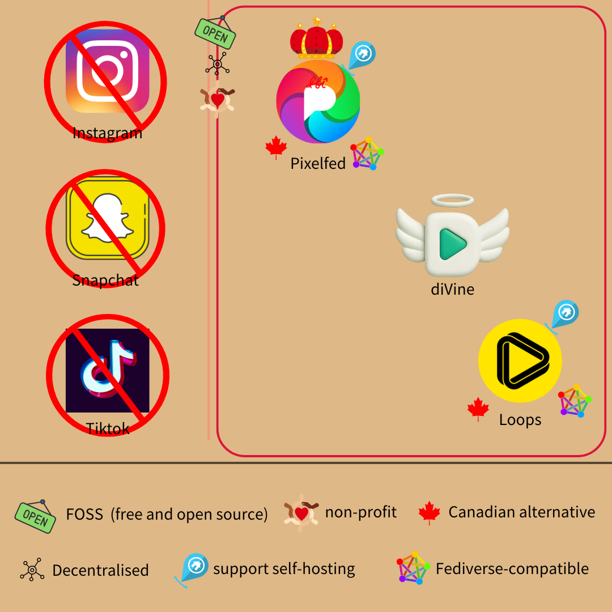
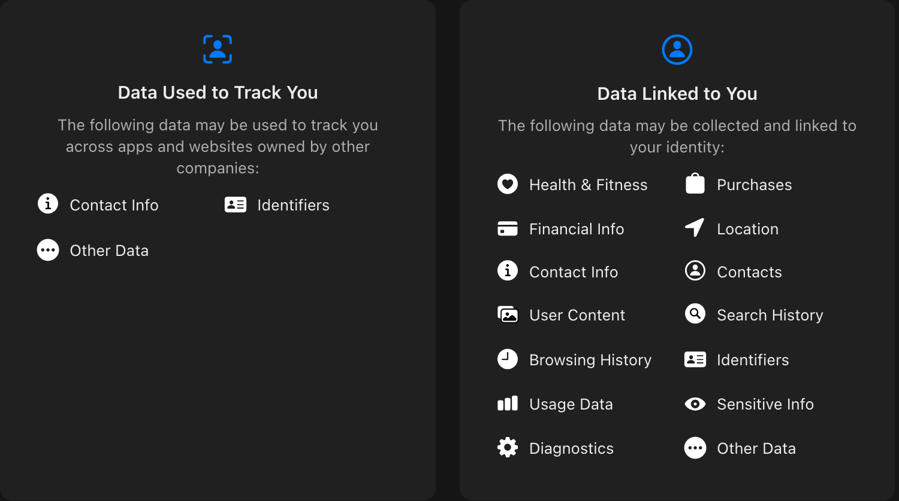

# deMeta - 替換 IG、抖音  

> Your metadata is now Meta data  

社群有人嘲諷 Meta，因為他們太會偷個資了  
如果你是醫界人士，習慣以 meta 簡稱 metastasis (腫瘤轉移)  
就能進一步諷刺：  
> Meta will meta to meta your metadata  

_# Meta 會轉移去偷 (Meta 幾乎可當偷個資、窺探的同義詞)你的 metadata_  

論及短影音、照片平台，主流軟體問題都不小，先看圖再說  
### 替換指南  
  
FOSS 指免費開源軟體 (Free and Open Source Software)  
non-profit 指「不以營利為目的」  

### 該換的服務  

#### Instagram (IG)  
以防有人不知道，IG 和 Facebook 一樣，都是 Meta 的產品  
Meta 在隱私、[資安](https://thehackernews.com/2024/09/meta-fined-91-million-for-storing.html)上都[劣跡斑斑](./deMeta-macroblog.md)，例如用明文儲存密碼、默許詐騙廣告肆虐  
Facebook 和 IG 都是，光密碼問題就[被罰](https://www.pcmag.com/news/meta-faces-101-million-fine-for-storing-facebook-passwords-in-plaintext) 9000 多萬歐元  
_# 明文儲存代表公司和員工能用你的密碼登入，當然，跑進伺服器的駭客也行_  
後來 IG 又[未經允許](https://www.gdprregister.eu/news/instagram-unauthorized-camera-access/)，[偷拿](https://www.cnet.com/tech/mobile/lawsuit-accuses-instagram-of-peeping-with-iphone-camera/)用戶相機權限，被集體訴訟告上加州法庭  
Meta 說那是 iPhone 的 bug，但兩家公司信用比一比，怎樣也不會相信 Meta 吧！  
如果你覺得偷拍很噁，那怎麼能忍受別人「用你的手機偷拍你」？  
  
而且 Meta 將在 2026 年底，[移除](https://proton.me/blog/instagram-end-to-end-encryption) IG 私訊的端對端加密  
原因沒細講，不過沒端對端加密，他們就能看到對話內容  
個人化廣告很缺這類素材  

#### Snapchat  
老一輩的聊天軟體，可以拍照片、短影片傳給朋友  
沒聽過最好，代表你沒踩到此雷  
地雷們：  
* Snapchat 提供「閱後即焚」功能，可以讓訊息在已讀後自動銷毀  
    官方以「讀後會從世上消失」行銷，結果卻[並非如此](https://www.slashgear.com/1563253/shady-side-snapchat-app-controversy-explained/)  
    接收者可儲存你的訊息，因為「閱後即焚」只在官方 app 有效  
    _# 意思是，若接收者用非官方的前端，訊息就不會消失_  
    且接收方影片儲存在 app 沙盒外、檔案未加密，可被外接電腦、程式讀取  
    傳送者容易產生「隱私的錯覺」，實際上卻幾乎形同一般訊息  
    若接收者用舊版 iPhone，你甚至不會收到他截圖訊息的通知  
    Android 更慘，官方說不會蒐集、利用地理位置追蹤用戶，實際上卻相反  
    資安同樣沒做好，造成 460 萬用戶名字和門號外洩  
    種種因素讓美國 FTC (公平交易委員會)，[要求](https://www.ftc.gov/news-events/news/press-releases/2014/05/snapchat-settles-ftc-charges-promises-disappearing-messages-were-false) Snapchat 限期改善  
每兩年稽查結果，每起問題開罰 16000 美元  
* 蒐集許多個資  
    直接看官方[隱私政策](https://naapbooks.com/insights/blog/how-snapchat-is-using-the-privacy-data-of-users/)，會蒐集許多敏感個資，例如：  
    電話、姓名、生日、地理位置 (現在補上了)、廣告 ID、裝置種類...  
    一般 app 就算了，Snapchat 資安如此薄弱，豈不形同交給駭客？  
* 內部濫用 (insider threat)  
    最嚴重的莫過於此  
    公司內部有個工具叫 [SnapLion](https://www.vice.com/en/article/snapchat-employees-abused-data-access-spy-on-users-snaplion/)，原先是應對執法單位，須提供用戶資料時使用  
    可以快速搜集使用者資訊，基本上只要 app 蒐集的個資都能打包  
    結果公司[沒妥善管理](https://threatpost.com/snapchat-privacy-blunder-piques-concerns-about-insider-threats/145074/) SnapLion，曾發生多起內部員工偷窺客戶的事件  
    類似「銀行要你給機敏個資，行員卻能不受監控、管理，亂看你的資訊」  
    愛拿又不保管好，儼然 Meta 翻版  
* 還有極具爭議的[假通知](https://www.reddit.com/r/SnapchatHelp/comments/1fcn53j/keep_getting_false_snapchat_notifications/)策略，目的是增加用戶黏著度，i.e. 讓你上癮  
    App 會跳通知，但該通知實際上[和你無關](https://www.reddit.com/r/lonely/comments/i6ctxl/the_dopamine_rush_i_get_from_one_snapchat/)、或你打開 app 時通知不見了  
    為什麼？  
    因為那只是為了讓你再開啟它、增加停留時間  

看到這還選擇留下來，那你很有台積 DNA (？)  

#### TikTok  
即[惡名昭彰](https://proton.me/blog/tiktok-privacy)的抖音，光入坑、下載就索取[許多資料](https://www.tiktok.com/legal/page/row/privacy-policy/en)  
例如生日、裝置 IMEI (i.e. 手機的指紋)、瀏覽記錄、IP...  
基本上就是中國版的 Meta，~~適合有暴露癖的人~~  
座標當然也躲不掉，如果你是美國人，甚至會被精確定位  
_# 非中國的鍋，這是美國強制收購抖音才有的_  
[美國版](https://www.cbsnews.com/news/tiktok-new-terms-of-service-privacy-geolocation-personal-information/)甚至還蒐集「種族、國籍、信仰、性生活、經濟狀態、駕照號碼、心理健康狀況」  
就算沒填，很多資訊仍可從日常使用推斷出來  
內建瀏覽器更危險，會插入追蹤程式碼，窺探你的：  
* 瀏覽記錄  
* 每個按下的按鈕  
* 選取的文字  
* 表單欄位的輸入  
    包括密碼、信用卡號、地址...  

_# 壞消息，上述資訊 IG、臉書的內建瀏覽器也會拿_  
* 每個[鍵觸](https://proton.me/blog/tiktok-keylogging)  

還不給預設其他瀏覽器，想逃只能手動複製、到外面貼上  
何況取得資料的是中企，幾乎形同[交給中國政府](./chinese-service-risk.md)  

內容和演算法問題也很多  
歐盟因抖音設計使人上癮，對其祭出[高額罰款](https://www.reuters.com/business/media-telecom/tiktok-hit-with-charges-breaching-eu-online-content-rules-app-may-have-change-2026-02-06/)  
[降智挑戰](https://tw.news.yahoo.com/13%E6%AD%B2%E5%B0%91%E5%B9%B4%E7%8C%9B%E5%97%91-3%E5%8C%85%E7%94%9F%E6%B3%A1%E9%BA%B5-%E8%B7%9F%E9%A2%A8-tiktok%E6%8C%91%E6%88%B0-%E6%85%98%E7%8C%9D%E6%AD%BB-081101232.html)也層出不窮，甚至造成[不少死傷](https://www.storm.mg/lifestyle/5359969)  
坊間才會有「抖音一響，父母白養」的諷喻  

### 替代品  

#### [Pixelfed](https://pixelfed.org/)  
聯邦宇宙的 IG 替代品，加拿大[社群開發者](https://pixelfed.social/dansup)製作  
[開源](https://github.com/pixelfed/pixelfed)、免費、尊重隱私，商業模式靠自願捐助  
聯邦宇宙 (fediverse) 是一系列使用相同協定的專案，服務可互通  
伺服器可自架，也有別人架好的能直接用，沒單一實體掌控整個生態  
簡單說就是「能選要辦哪家的 IG 帳，還能用 IG 追別人推特」  
_# 不只先前介紹的 [Mastodon](./deMeta-microblog.md)、[Friendica](./deMeta-macroblog.md)，就連 Meta 的 Threads 也通喔！_  
功能、介面和 IG 相似，只是少了廣告和追蹤器  

缺點：  
* 快速開發中，偶有功能不穩  
    雖已行之有年，但用戶增長頗快，擴展服務會造成一些負擔  
* 私訊**沒**端對端加密，站方能看到內容，就像 IG 一樣  
    不同的是，Pixelfed 隱私政策友善多了，不會沒事偷窺  
* 無個人化演算法，滑一滑很容易就覺得無聊  
    這可能算好處，畢竟目的和主流平台不同，不是為了[讓你成癮](https://www.bbc.com/news/articles/c3wlpqpe2z4o)而設計  
    協助避免「睡前滑手機的 5 分鐘，是我一天最快樂的三個小時」窘境  

至於怎麼選伺服器，可以看各伺服器的介紹  
用戶多屬哪種類型，會影響平常看到的內容  
_# 當然，還是可以去翻其他伺服器的圖文_  

 

IG 的開源、優質替代品很少，接下來就換抖音了  

 

#### [diVine](https://divine.video/discovery/classics)  
[開源](https://github.com/divinevideo)、分散式、非營利的短影片平臺，標榜「人做的 (human-made)」內容、杜絕 AI  
_# 看到 AI 內容可以檢舉，屬實會遭撤下_  
影片 6 秒為限，~~酷似降智抖音~~  

---

講古 (可略)  
從前有個平台叫 Vine，以 6 秒短影片為特色  
曾盛極一時，擁有 2 億用戶、還被推特收購  
但 2017 因競爭者眾、財源問題，推特終止了 Vine  
後來前推特 CEO Jack Dorsey，靠旗下非營利機構「其他東西 (Other Stuff)」資助復刻  
推出 diVine 當接替者，甚至把許多 Vine 當初的影片重新上架  
diVine 於焉誕生  

---

缺點：  
* 不通聯邦宇宙 (fediverse)，想追 [Pixelfed](https://pixelfed.org/) 上的內容需要橋接器  
    diVine 使用 Nostr protocol，協定不同自然不直接相容  
* 不接受 AI 內容  
    對不喜歡 AI 的人來說，也許算好處  
* 似乎沒做 SEO，搜尋排序不佳  
    拿「diVine」去搜尋引擎找，恐怕無法第一時間挖到此平台  
* 無端對端加密私訊  

討厭 Jack Dorsey 的人別擔心，他只是提供奧援，並未持有 diVine  

 

#### [Loops](https://loops.video/)  
直翻「迴圈」，是聯邦宇宙 (fediverse)的抖音替代品  
[伺服器](https://github.com/joinloops/loops-server)、[應用程式](https://github.com/joinloops/loops-expo)都開源，且免費、無廣告  
_# 主要開發者和前述 Pixelfed 是同一個喔！_  
功能和一般短影音平台相近，只是少了追蹤器、大量演算法推送  

缺點：  
* 尚在早期公測，難保證穩定性  
    尖峰時偶爾會 lag，Pixelfed 曾經也有類似情況 (現已改善不少)  
* 用戶較抖音少，內容也許沒那麼豐富  

聯邦網路的好處，就是能追蹤其他服務，例如 [Pixelfed](https://pixelfed.org/)、[Mastodon](https://mastodon.social/explore)  
且有多個服務站點能選，不爽還可以自己架  

 

---

 

### 懶人包  
* 換 IG → [Pixelfed](https://pixelfed.org/)  
* 換抖音：  
    * 想加入聯邦宇宙 (fediverse) → [Loops](https://loops.video/)  
    * 不喜歡 AI 內容 → [diVine](https://divine.video/discovery/classics)  

應該夠懶人了，畢竟就三個而已  

