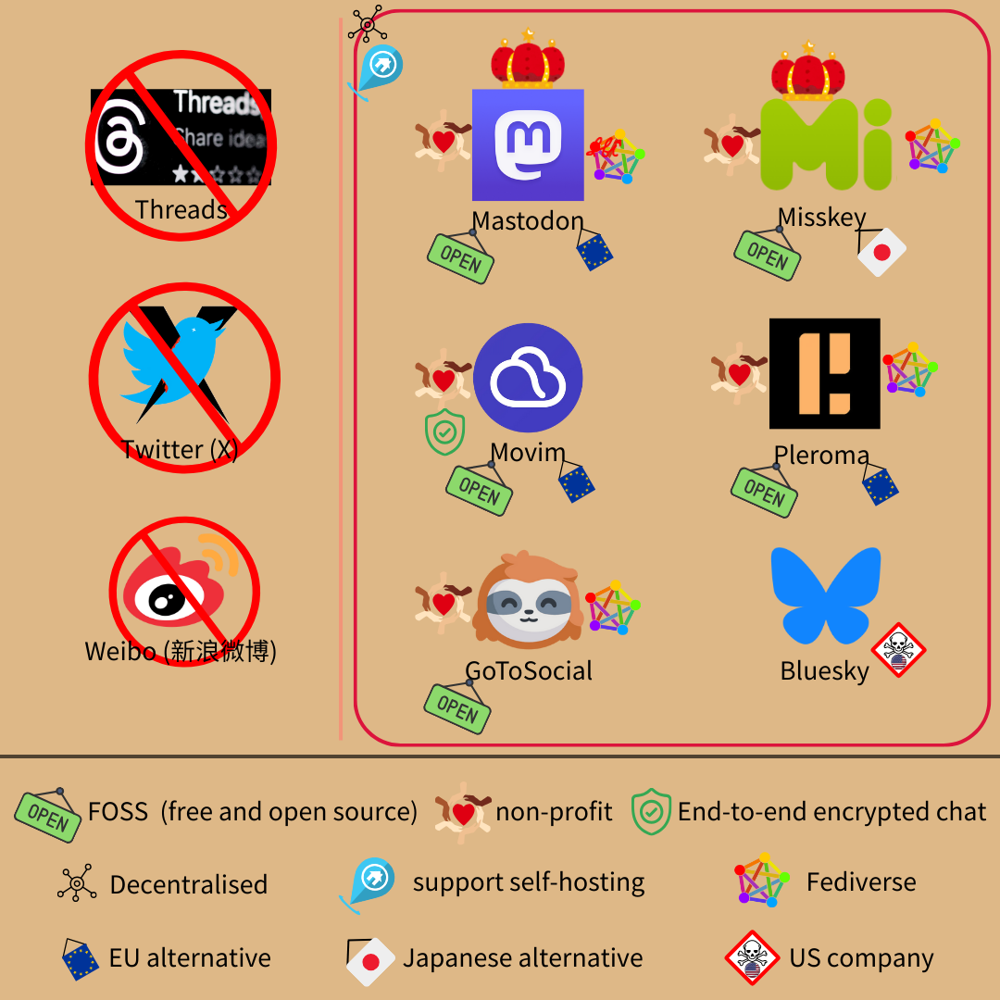
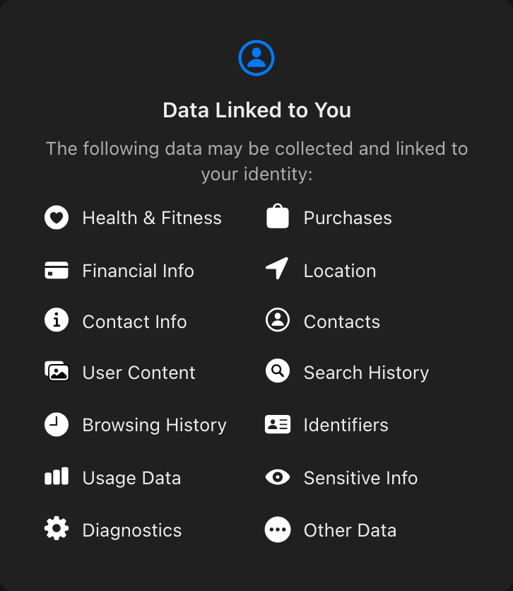
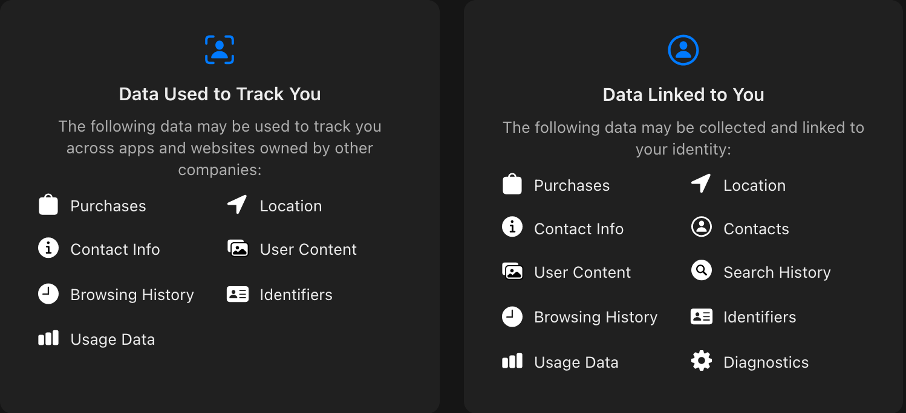

# deMeta - 替換 Threads (和推特)  

> Threads 網友好偏激，都容不下異議  

這不是個案，而是[演算法](https://tw.news.yahoo.com/threads-%E5%BC%95%E6%88%B0%E6%BC%94%E7%AE%97%E6%B3%95-%E5%B0%87%E5%9B%9E%E6%AD%B8-%E5%90%8C%E6%BA%AB%E5%B1%A4-%E7%B2%89%E7%B5%B2%E6%95%B8%E9%87%8D%E8%A6%81%E6%80%A7%E5%86%8D%E5%BA%A6%E8%A2%AB%E6%94%BE%E5%A4%A7-003332397.html)使然  
用過臉書、IG 的人應該很熟悉，Meta 善於將氣味相投的內容推給你  
同溫層特別厚，想法容易正向增強，不論合理與否  
極端者可以圍小圈圈取暖，但中間派會被各方拉扯  
_# 不過 Threads 早期採用引戰演算法，推薦另一個極端讓用戶吵架 (增加互動)_  
Threads 身為 Meta 用來[搶推特難民](https://www.arabnews.com/node/2335576/media)的產品，在馬斯克收購推特時[趁勢崛起](https://www.gvm.com.tw/article/104383)  
當時甚至有許多功能缺陷，但敵營助攻下已成為最受歡迎的社群軟體之一  

講那些做什麼呢？  

提及背景才好解釋，為何把 Threads 和 Twitter (X) 放在一起換  
兩者為同質性產品，且對用戶隱私、平台管理都有劣跡，該換就換  

### 圖先來：  
  
FOSS 指免費開源軟體 (Free and Open Source Software)  
End-to-end encrypted chat 指私訊為端對端加密  

### 應換能換而未換  
#### Threads  
打頭陣的當然是 Threads，不只用戶體驗，個資問題也很大  
若 Google 自稱頭號偷窺狂，恐怕只有 Meta 能問鼎  
Threads [隱私政策](https://adguard.com/en/blog/guide-to-metas-threads-app-privacy-concerns.html)說明，它會[蒐集](https://time.com/6299743/threads-data-collection-privacy/)：  
健康、財務、用戶位置、搜尋紀錄[...](https://www.theguardian.com/technology/2023/jul/11/threads-app-privacy-user-data-meta-policy)  
許多是[非必要](https://www.cpomagazine.com/data-privacy/newly-launched-threads-already-raising-privacy-concerns-with-sensitive-data-collection-instagram-sharing/)、且侵略性的個資  
這不是我說的，是 Meta 說的：  
  

何況 Meta [名聲不太好](https://proton.me/blog/meta-threads-privacy)，把個資交給他們不太安全  

#### Twitter (Χ)  
從前的推特 (Twitter)，馬斯克收購後更名為 Χ  
收購消息傳出後，推特用戶大舉出逃，且罵聲一片  
不過推特本身就有不少問題，也不尊重用戶隱私  
例如宣稱取得用戶門號、email 是為了帳戶安全，卻偷偷拿去推個人化廣告  
此舉被美國 FTC (類似台灣公平交易委員會)[開罰](https://www.ftc.gov/news-events/news/press-releases/2022/05/ftc-charges-twitter-deceptively-using-account-security-data-sell-targeted-ads)，近一億五千萬美元  
還有重大[資安漏洞](https://proton.me/blog/twitter-breach)，用 email、門號就能洗出推特上的[資訊](https://www.twingate.com/blog/tips/twitter-data-breach)  
_# 用流水號窮舉，即可抓出用戶們的個資_  
4 億以上用戶資訊被拿去[暗網販售](https://www.bbc.com/news/technology-64109777)，[推特](https://thecyberexpress.com/twitter-data-breach-twitters-response/)官方還[否認](https://www.theverge.com/2023/1/6/23542038/twitter-hack-200-million-email-./file_namees-usernames-affected)呢！  
其餘像帳號冒用、大小資安事件也[層出不窮](https://firewalltimes.com/twitter-data-breach-timeline/)，還用明文存過密碼~~方便被盜~~  
_# 小提醒，原推特也和 Meta 一樣會亂關帳喔！_  

馬斯克收購後，有比較好嗎？  

沒有，而且多了[其他問題](https://www.amnesty.org/en/latest/news/2023/09/global-xs-new-policy-risks-violating-right-to-privacy-for-millions/)  
例如：蒐集生物資訊 (biometrics)、用戶位置 (包括私訊時)，還會拿去練 AI  
生物資訊可能是聲音、影像、動作等，Χ 上有很多影片，推測真人影片也是蒐集對象  
為什麼說「可能」和「推測」？  
因為官方沒說清楚，資訊很不透明  
至於位置，官方說會拿、還會追蹤你：  
  
Χ 用戶應該很有感，位置甚至[公開](https://www.tesaaworld.com/en/news/a-new-feature-on-x-raises-privacy-concerns-among-users)讓大家看  
會推送[個人化廣告](https://www.cnbc.com/2023/12/14/musks-x-hit-with-complaint-alleging-it-broke-europes-privacy-laws.html)，而且[缺乏透明性](https://ec.europa.eu/commission/presscorner/detail/en/ip_24_3761)  
[資料外洩](https://www.foxnews.com/tech/200-million-social-media-records-leaked-major-x-data-breach)也沒少，資安和隱私都沒顧到  
諷刺的是，馬斯克當初反對推特文字獄，提倡[絕對言論自由](https://www.npr.org/2022/10/08/1127689351/elon-musk-calls-himself-a-free-speech-absolutist-what-could-twitter-look-like-un)  
買下推特時解封不少帳號，包括他支持的[川普](https://www.cbsnews.com/amp/news/elon-musk-says-donald-trump-reinstated-twitter/)  
然而，Χ [封殺](https://www.politico.eu/article/musks-x-suspends-opposition-accounts-turkey-protest-civil-unrest-erdogan-imamoglu-istanbul-mayor/)許多[用戶](https://www.bbc.com/news/articles/c0589g0dqq7o)，尤其[持異議者](https://www.bbc.com/news/articles/c77r1p887e5o)  
數量甚至[超過](https://fortune.com/2024/09/25/twitter-x-account-suspensions-triple-transparency-report-elon-musk/)原推特，這言論可真*自由*  

#### 新浪微博 (Weibo)  
從 2012 起，中國就[實施](https://digitalcommons.law.uw.edu/wilj/vol25/iss1/3/)網路實名制  
平台會取得用戶姓名、身分證號等資訊，存在後台備用  
號稱為了防範假訊息，但對隱私、言論管控都有重大影響  
2022 開始會[公布](https://www.scmp.com/tech/big-tech/article/3174487/chinese-social-media-display-user-locations-based-ip-./file_name) IP，2023 連真名、教育背景、性別、公司...都[公開](https://advox.globalvoices.org/2023/10/23/new-policy-requires-chinese-influencers-to-display-their-personal-information-on-weibo/)  
已非「公司拿個資」的程度，而是所有人都能看到  
何況個資交給中國公司，就[幾乎等同](./chinese-service-risk.md)交給政府，不可不慎  
微博也發生過[重大外洩](https://www.business-humanrights.org/en/latest-news/china-weibo-admits-to-leak-of-personal-data-on-millions-of-users/)，[五億多人](https://www.zdnet.com/article/hacker-selling-data-of-538-million-weibo-users/)的個資被拿去[暗網](https://3cyber-sec.com/2021/06/21/one-of-the-biggest-data-breaches-of-the-century-sina-weibo/)販售  
新浪第一時間還否認，但都能買到了誰管官方怎麼說  
同之前所述：  
> 不該蒐集的個資就別蒐集，否則徒增風險  

只要不拿，就不會外洩  
因此用新浪微博，除了官方、中國政府，其他所有人都很有機會取得你的隱私  
能不換嗎？  
_# 你有暴露癖就不用換_  

---

### 替代方案  
#### [Mastodon](https://mastodon.social/)  
以古生物「乳齒象」為名，是開源、去中心化、尊重隱私的社群  
由德國非營利機構、社群合建，任何人都能自架伺服器  
_# 收入靠捐助、販售吉祥物，沒商業模式_  
無廣告和追蹤演算法，靠聯邦宇宙 (fediverse)和其他服務串聯  
言論自由、民主程度，是最接近馬斯克「理想推特」的專案  

---

聯邦宇宙 (fediverse)  
用 [ActivityPub](https://activitypub.rocks/) 協定互通，不僅 Mastodon 實例 (instance)，也可和其他服務串連、互動  
E.g. [Peertube](https://joinpeertube.org/) (影片)、[Pixelfed](https://pixelfed.org/) (類 IG 服務)、Threads  
沒錯，Threads 也支援 ActivityPub (但 Threads 沒全開源)  
這種 Federated 互通的方式，讓任何人都能自架伺服器  
不滿哪個 instance 就搬走，甚至自己維運也行  
缺點是「非完全分散」，仍部分受制於伺服器維護者  
比傳統集中式服務如 Threads、FB、Χ 等民主不少，但不若區塊鏈分散  

---

上述看不懂沒關係，簡單說 federation 就是帳號存在伺服器上  
只是大家都能架伺服器，不受特定廠商控制  
除了官方 [instance](https://mastodon.social/explore)，也可以找[自己喜歡的](https://joinmastodon.org/servers)，例如較多台人的[零時政府](https://g0v.social/explore)  
因為開源、用公定標準，手機 app 不一定要選官方的  
_# 直接從瀏覽器使用也行_  
Mastodon 流量還算高，是替換推特的首選之一  

缺點：  
* 私訊沒端對端加密  
* 自行架設硬體要求高  
* ~~吉祥物過於可愛~~  
  

Mastodon 是許多專案的源頭，不少服務都從此處 Fork 出去，包括川普的真實社群  
但真實社群起初不承認，被[控訴侵權](https://www.theverge.com/2021/10/29/22752850/mastodon-trump-truth-social-network-open-source-gab-legal-notice)後才公開程式碼  
而且真實社群由川旗下的集團維運，不在保障隱私的範圍內  
_# Mastodon 使用 AGPL [開源](./open-source-intro.md)，下游專案也必須用同樣方式開源_  

#### [Misskey](https://misskey-hub.net/en/)  
和 Mastodon 很像，都是開源、社群驅動、聯邦宇宙串聯的去中心化服務  
原初開發者為日本人篠田英司，主要用戶也在日本、東亞  
體驗比較像日本社群，畢竟用戶組成會影響內容  
_# 可理解成日系的 Mastodon_  
伺服器可自架、支援圖片編輯功能，也可自動加客製化浮水印  
_# 推測是日本繪師多，比較有此需求_  
屬於聯邦宇宙的一部份，所以能透過 Misskey 追 Mastodon 的內容  
多帳號切換容易，~~可以辦很多小帳亂搞~~  
介面風格獨樹一幟，同樣沒廣告、演算法，用起來很乾淨  

缺點：  
* 旗艦伺服器 misskey.io 由 MisskeyHQ 營運  
    不過和專案開發互不隸屬，只是合作關係  
    且經費主要靠捐款，尚無實質商業模式，所以可能稱不上缺點？  
* 私訊無端對端加密  
名稱由來是開發者當時在聽 May'n 的歌《[Brain Diver](https://www.youtube.com/watch?v=Efrlqw8ytg4)》，把歌詞「Miss key」變形而成  
把「錯過的鑰匙」引申為「錯過的機會」，~~但感覺有點隨便~~  

### [Movim](https://movim.eu/)  
My Open Virtual Identity Manager, Movim，指公開虛擬身份管理器  
白話就是指**社群**，同樣開源、去中心化，開發者 Timothée Jaussoin 是法國人  
伺服器可自架，稱為實例 (instance) 或 pod  
從旗艦伺服器網域 movim.eu 可知，主要發跡在歐洲  
_# 另一個旗艦 mov.im 一樣設在歐洲_  
不過用的不是 ActivityPub，而是另一個知名協議 XMPP  

---

Extensible Messaging and Presence Protocol, XMPP (可延伸訊息與表示協定)  
起初用於訊息收發，後來擴展支援視訊、內容傳播 (e.g. 動態)等功能  
有許多前端支援此協議，例如 [Conversations](https://conversations.im/) 能收發訊息  
Movim 就整合了 XMPP 後端和上述功能，變成統一前端  
你只需要知道，Movim 是個用 XMPP 通聯的 app 即可  

---

所以不同伺服器的用戶能互通，但無法直接進入聯邦宇宙  
_# 可理解成不同平行宇宙，需橋接器才能互動_  
最特別的是，私訊**有**端對端加密  
透過 OMEMO 擴充 XMPP，使對話獲端對端加密保障  
訊息仍由伺服器轉發，但維運者只會看到亂碼  
解密鑰在用戶手上，例如瀏覽器的 IndexedDB 裡  
無廣告，主要靠捐款支持運作  
Movim 可當 Facebook、Twitter 用，有短貼文和長文模式  
所以視為 microblog 或 macroblog 都行  

缺點：  
* 旗艦伺服器在歐洲，台灣用戶可能會有點延遲  
    但你可以選[其他地區](https://join.movim.eu/)的伺服器  
* 和聯邦宇宙 (Fediverse)未直接互通  

和 Mastodon、Misskey 一樣支援 Progressive Web App (PWA)  
能以應用程式的形式裝在瀏覽器裡，使用上頗方便  
_# 不知道 PWA 是什麼也別怕，你大概不需要此功能_  

#### [Pleroma](https://pleroma.social/)  
一樣支援聯邦宇宙 (fediverse)、無廣告非營利、伺服器可自架  
開發者為德國人，化名為 Lain，[CC BY-ND 4.0](https://creativecommons.org/licenses/by-nd/4.0/) 開源  
功能與其他服務大同小異，最大的差異在架設  
相較 Mastodon 的技術堆疊，Pleroma 非常[輕量](https://blog.soykaf.com/post/what-is-pleroma/)  
Mastodon 需要 Rails / PostgreSQL / Redis / Sidekiq / NodeJS 和 ElasticSearch  
可理解成工程繁複，硬體需求也高  
_# 別擔心，那些技術只在「你要架伺服器」時，才會用上_  
Pleroma 只需要 Elixir 和 PostgreSQL，和一個樹莓派 (Raspberry Pi，某種單板電腦)  
對我這種窮人來說，可謂非常友善  
換句話說，對用戶沒差，但架服務的維運者更省資源  
手機 app 和 mastodon 相通，可用相同前端連上  

缺點：  
* 私訊無端對端加密  
* 用 CC BY-ND 4.0 開源，有些限制  
* 流量較低，~~想當網軍不太適合~~  

#### [GoToSocial](https://gotosocial.org/)  
直翻「走去社交」，潛台詞耐人玩味  
一樣是[開源](https://codeberg.org/superseriousbusiness/gotosocial)、社群主導、非營利的聯邦宇宙 (fediverse)服務  
伺服器**得**自架，無廣告或推薦演算法，且非常輕量  
_# 樹莓派、舊筆電即可，除了 Go 寫成的主程式，只需要再一個 [SQLite](https://www.sqlite.org/index.html)_  
接受捐助，若企業捐款可獲得 logo 標示  
明言專案方向 100% 由開發者決定，企業提議功能、改進的聲量與大眾無異  
_# 避免被金主綁架，且軍火商這類有道德爭議者謝絕捐助_  
GoToSocial 特殊之處，就是從設計理念就顛覆傳統社群平台  
希望打造的是「小圈圈」，讓大家自架伺服器或加入親友架設的服務  
所以官方**沒**旗艦伺服器，鼓勵入坑者自行架站  
_# 硬要說還是有，即官方帳號所在的實例 ([instance](https://gts.superseriousbusiness.org/@gotosocial))_  
理想情境是：你 (開發者)架服務，邀請好友架服務互聯、或直接加入你的伺服器  
你們可以活在自己的小圈圈，也能以該站為出發點，連到聯邦宇宙其他地方  
簡單比喻的話：  
推特是帝國制；Mastodon 是不同國家、彼此有聯繫；GoToSocial 是社區互助會  
功能管理也很細緻，傳統社群幾乎望塵莫及  
* 能[控制](https://docs.gotosocial.org/en/latest/user_guide/posts/)分享範圍，公開、不公開 (知道連結者才能看到)、互追限定、私訊...  
* 互動亦同，轉貼、按讚、回覆都能選擇開啟或關閉  
* 除了一般的封鎖功能，還能建立允許、封鎖清單  
    且可分享給別人、引用他人建立的名單  
    可多人維護一個網軍清單，通通 ban 掉不用各自封鎖，此功能值得各大平台借鑑  
    _# 酷似 [uBlock Origin](https://ublockorigin.com/) 的追蹤器、廣告清單原理_  

上傳圖片時，預設會幫你清除 EXIF (meta data)  
不會暴露圖片拍攝時間、裝置種類等資訊  
_# 一般圖檔往往帶有和圖無關、但非常機敏的資訊，只是多數人不知道_  

缺點：  
* 需自行架設服務  
    或許也算優點，因為設計初衷就是小圈圈的社群  
* 仍在 Beta 階段，可能會有功能不穩的情況  
* 只有後端，要自己找前端  
    別擔心，它和 Mastodon API 相容，隨便找個別人寫的開源 [app](https://f-droid.org/en/packages/com.keylesspalace.tusky/) 就行  
    E.g. [Tusky](https://tusky.app/) (Android)、[Feditext](https://github.com/feditext/feditext) (iOS)  
* mp4 尚無法自動移除 EXIF 資訊，官方建議上傳前先手動清除  
* 私訊無端對端加密  
    畢竟就是設計給朋友圈用、甚至各自架站，不用擔心 Meta 莫名其妙的廠商偷窺  

和 Movim 一樣，有長文和短文模式  
短文符合本篇「Microblog」主題，就放進來了  

#### [Bluesky](https://bsky.app/)  
直翻「藍天」(和台灣政治無關)，是**推特正統繼承者**  
由原團隊開發、經營，只是更開放  

---

講古 (技術導向，可略)  
推特 CEO 傑克多西 (Jack Dorsey) 在 2019 年推動研製「開放、去中心化的媒體標準」  
此標準就是 Authenticated Transfer Protocol，簡稱 AT protocol 或 ATProto  
將推特的社群生態[拆成](https://docs.bsky.app/docs/advanced-guides/federation-architecture) identity (身份)、data hosting (資料儲存)、distribution & indexing (分發、索引)、feeds (演算法)、moderation (內容治理)  
模組化可替換，不必整個社交體驗丟掉  
[身份](https://atproto.com/guides/identity)用穩定、可換宿主的錨點存，就算換帳號、主機還是能解析 (遷移不怕丟失)  
貼文、個人檔案等公開資料，則用任何人都能驗證的簽名[託管](https://atproto.com/specs/repository)  
可想像成 git 的 commit 放在某個公開 repo 裡，確保帳號在「某版 (某時間)」長什麼樣  
且不必受制特定伺服器，大家都能驗證  
接著 Relay 會爬各處的貼文狀態，由 AppView 建索引分發給用戶看  
如此一來，即使官方的 Relay / AppView ~~被我炸壞~~故障，任何第三方都能遞補  
「Relay 爬狀態」到「AppView 呈現結果」間，還有 Labeler 和演算法插手  
Labeler 負責貼標籤~~歧視~~，把貼文用特定方式分類 (e.g. NSFW)  
再由用戶設定決定是否呈現、如何呈現 (你可以設定模糊顯示敏感內容，或直接擋掉)  
_# 官方預設使用自家開源的 [Ozone](https://docs.bsky.app/blog/blueskys-moderation-architecture)，作為貼標工具_  
演算法由 feed generator 產生，可替換成任何相容者  
_# 當然，預設還是官方的_  
代表你不一定要接受「官方推給你什麼」，可以「自己決定要看什麼」  
Bluesky 就是 ATProto 的實作，bsky.app 是官方維運的旗艦伺服器  

---

簡單來說，就是推特的研發部做了分散式的推特  
而且開源、相對隱私友善  
在馬斯克收購推特後，獨立成新公司  
_# 不過如同 Jack Dorsey 一貫作風，他生氣退出董事會了，改由 Jay Graber 當 CEO_  
公開貼文幾乎不擋訪問，雖然利於研究者，但也容易被[爬蟲](https://www.eff.org/deeplinks/2024/12/what-you-should-know-when-joining-bluesky)抓取  
可建立「[app password](https://docs.bsky.app/docs/api/com-atproto-server-create-app-password)」，也就是給特定軟體的密碼  
就算你存密碼的工具被盜，也不影響你主密碼  
app password 能鎖特定權限，例如私訊  
可控制被盜帳的損害，也能推知從何處被滲透  

缺點：  
* 美國**公司**，部分受制美國政府  
    Bluesky 是公益公司 (Public Benefit Corporation)，或許沒那麼糟  
* 有商業模式  
    官方[說](https://bsky.social/about/blog/10-24-2024-series-a)[不會](https://www.cnbc.com/2025/01/22/how-bluesky-twitters-one-time-side-project-is-challenging-x.html)走「鎖死用戶塞廣告」的模式，目前主要靠[融資](https://techcrunch.com/2023/07/05/bluesky-announces-its-8m-seed-round-first-paid-service-custom-domains/)  
    之後預計推出[訂閱版](https://www.euronews.com/next/2024/12/10/bluesky-tests-paid-subscription-features-as-social-media-giant-grows)，可客製化[網域名](https://blueskyweb.zendesk.com/hc/en-us/articles/19001802873101-How-to-Set-your-Domain-as-your-Handle)、頁面、徽章和分析等眾多功能  
    類似「Bluesky+」，免費版有多數功能  
    名人、特殊需求者、~~有錢人~~則**可**訂閱  
    之後也[可能](https://techcrunch.com/2025/04/16/bluesky-feed-builder-graze-raises-1m-rolls-out-ads/)有第三方，推出訂閱特定演算法的服務  
* 去中心化實踐不佳  
    雖然和 Fediverse 一樣，大家都能自架伺服器  
    但幾乎所有用戶都在旗艦伺服器上，沒有較具規模的第三方實例 (instance)  
    因此「理論上」能分散，實際上卻近乎傳統集中式服務  
* 私訊**沒**端對端加密，官方能存取對話內容，被檢舉還可能遭[人工查看](https://bsky.social/about/blog/05-22-2024-direct-messages)  
    社群一直有端對端加密呼聲，但官方尚未實作，目前僅能靠第三方[工具](https://www.germnetwork.com/blog/germdm-atproto-now-beta)加密  
* ATProto 不像 ActivityPub 是 W3C 標準，協議掌控在 BlueSky 手上  
    會不會改、想怎麼改由他們決定，不必公開討論  
      
截至 [2025 年底](https://backlinko.com/bluesky-statistics)，Bluesky 註冊用戶數已超過 4000 萬  
日活躍用戶數逾百萬，流量相對充足  

### 懶人包  
* 一般用戶，想找現成的服務：  
    * 偏好類似推特、但更乾淨的選擇：  
        * 想加入 Fediverse → [Mastodon](https://mastodon.social/explore) / [Pleroma](https://pleroma.social/)  
            喜歡「日系推特」→ [Misskey](https://misskey-hub.net/)  
    * ~~盲目追隨~~推特團隊粉絲、想被演算法掌控 → [Bluesky](https://bsky.app/)  
    * 想要端對端加密私訊、有時會發長文 → [Movim](https://movim.eu/)  
* 開發者，想自架伺服器：  
    * ~~有錢人~~資源充足：  
        * 喜歡 Fediverse 生態系 → [Mastodon](https://mastodon.social/explore) / [Misskey](https://misskey-hub.net/)  
        * 想試試 ATProto 模組化架構 → [Bluesky](https://bsky.app/)  
        * XMPP 粉絲 → [Movim](https://movim.eu/)  
* ~~一級貧戶~~資源受限：  
    * 想要類似推特的體驗 → [Pleroma](https://pleroma.social/)  
    * 偏好小圈圈，不管其他人死活 → [GoToSocial](https://gotosocial.org/)  

---

當然，你也可以用更徹底的方式奪回隱私 - 不用社群軟體  
不是每個人都有社群需求，不需要的人自然可以不用  
不用社群，就不怕個資從社群流出  

