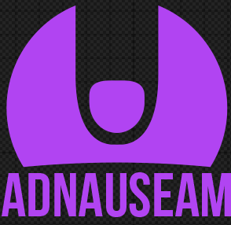

# 擋廣告還能幫助創作者 - AdNauseam  

> 裝廣告攔截器是在傷害創作者  

有些人認為，創作者收益比觀眾隱私重要  
不過「擋廣告」不代表扼殺金流，兩者可以並存  

 

### 懶人包  
使用 [Firefox](https://www.firefox.com/) 家族的瀏覽器，然後安裝 [AdNauseam](https://addons.mozilla.org/en-US/firefox/addon/adnauseam/) 外掛  
完成，夠懶了吧！  
_# 記得玩一玩設定，確保攔截最大化、自動點擊運作無礙_  

  

 

### 數位廣告如何運作  
_# 如果你已知數位廣告運作機制，請直接跳過本段落_  
許多內容創作者會在第三方平台發布作品，例如 Youtube、推特、臉書  
營運者提供平台、創作者產出內容、閱聽人享受服務，看起來很美好  
問題是平台有營運成本、內容創作者也想賺錢，所以需要商業模式支撐  
平台於是投放廣告，和創作者拆分收益  
所有參與者：  
* 平台，例如 Youtube  
* 創作者，例如[李宏毅](https://www.youtube.com/@HungyiLeeNTU) (他沒開分潤平台還是會投廣告)  
* 閱聽人，例如你我  
* 廣告刊登者，例如無國界醫生、IKEA (如果平台是[臉書](./deMeta-macroblog.md)，就還有詐騙、博弈產業)  

IKEA 拍廣告、創作者生產內容 → Youtube 投放廣告、閱聽人消費內容  
金流：  
閱聽人觀看 / 點擊廣告 → IKEA 按曝光率付 Google 錢 → Google 和創作者近乎對半分  
廣告攔截器阻斷「觀看、點擊」，上游斷炊自然使創作者、Google 拿不到錢  
解決方案很多種，例如贊助創作者、付費訂閱制、業配 (獲利最多的方法)...  
或者，安裝 [AdNauseam](https://addons.mozilla.org/en-US/firefox/addon/adnauseam/)  

### [AdNauseam](https://adnauseam.io/) - 廣告點擊器  
Ad nauseam 源自拉丁文，指討論到爛、很煩的東西，此處引申為廣告  
開頭「Ad」剛好也是廣告的縮寫，雙關廣告的煩人特質  
特別之處在於，AdNauseam 並「非」廣告攔截器，而是**廣告點擊器**  
[開源](https://github.com/dhowe/AdNauseam/)、從[神級廣告攔截器](./privacy-tracker-blocker.md#ublock-origin) [uBlock Origin](https://addons.mozilla.org/firefox/addon/ublock-origin/) 分支而來，是瀏覽器外掛  
和廣告攔截器相同，都會比對清單、攔截廣告  
不過廣告攔截器把請求阻斷就停了，抹去廣告、保障用戶隱私、也省下流量  
而 AdNauseam 會額外「蒐集」被擋掉的廣告，在背景一一「點擊」  
_# 即代替你造訪**每個**廣告連結_  
使用者只會發現廣告都消失，和一般廣告攔截器體驗差不多  
_# 也可以自行查看[戰果](https://wiwi.blog/blog/adnauseam/)，就能知道點了多少廣告_  

為什麼要點擊每一個廣告？  
因為要塞假資訊給廣告端點，同時活化金流鏈  
支持創作者又*危害*廣告商，最小程度犧牲隱私和瀏覽體驗  
廣告全都被點閱，創造比一般曝光更多的收益，創作者和平台都能拿到錢  
但因為沒人購買商品，長期下來會拉低平台的轉換率  
IKEA 花一堆錢卻沒廣告效果，Google 的議價能力就會降低  
對個人化廣告的商業模式來說，是積極的打擊行為  

缺點是廣告商還是會拿到活動紀錄，畢竟造訪了廣告端點  
不過無差別點擊廣告的好處，就是至少不會暴露偏好  

 

---

 

對願意犧牲部分隱私，換取支持創作者、反擊侵略性廣告的人來說，AdNauseam 正合用  

