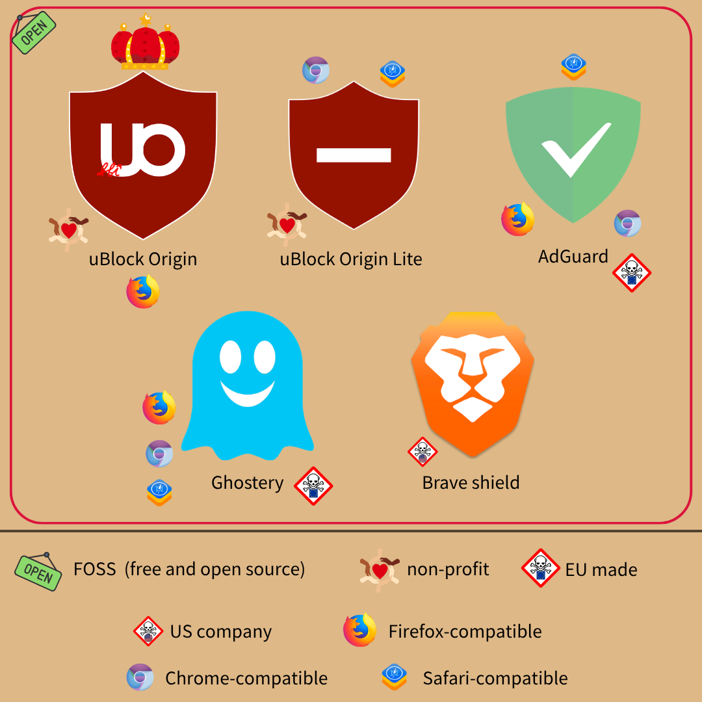

# 你在找的廣告攔截器 (ad blocker)  

> 上網搜尋時，記得開廣告攔截器  

這不是我說的，是 FBI [說的](https://www.pcmag.com/news/fbi-recommends-installing-an-ad-blocker-to-dodge-scammers?test_uuid=04IpBmWGZleS0I0J3epvMrC&test_variant=A)  
因為仿冒、詐騙廣告過多，FBI 給了[幾個建議](https://www.ic3.gov/PSA/2022/PSA221221)：  
_# [Meta](https://www.reuters.com/investigations/meta-tolerates-rampant-ad-fraud-china-safeguard-billions-revenue-2025-12-15/) 不喜歡這段言論_  
* 手打網址  
    怕搜尋結果包含惡意仿冒網站，最好的做法就是不靠搜尋引擎  
    雖然我常常這麼做，但對一般人來說可能有點難，退而求其次就是善用書籤  
    _# 如果你也都腦背網址，那很棒_  
* 點網址前再三確認，是否為官方連結  
    這也有點難，如果背得起來直接自己打不就好了  
    何況仿冒網址越來越真偽莫辨，和正牌擺在一起都不見得能一眼判斷  
* **用廣告攔截器！**  
    只要都沒廣告，就不怕點到詐騙廣告  
    寧可錯殺，不可錯放！  

問題是，該用哪個？  

### 廣告攔截器  
相信各位都是為了瀏覽體驗...我是說安全性，所以選擇擋廣告  
這就推薦幾個，[開源](./foss-and-privacy.md)、免費、高效的廣告攔截器  
_# 本篇未受任何贊助，~~沒人要給我錢嗚嗚嗚~~_  

首發當然是：  
#### [uBlock Origin](https://ublockorigin.com/)  
地表最強廣告攔截器，常簡稱 uBO  
uBO 是瀏覽器外掛，Google 調整 Chrome 之後不再支援  
但 [Brave](https://brave.com/)、[Firefox](https://www.firefox.com/) 系列瀏覽器都完整支援，**免費**、**開源**、積極維護  
_# 瀏覽器細節請參見[前文](./deGoogle-browser.md)，過去就介紹過 uBlock Origin_  

  

到應用程式商店就能裝，還被 [Firefox 官方推薦](https://addons.mozilla.org/en-US/firefox/addon/ublock-origin/)  
只要安裝，就會進入幾乎無廣告的世界  
Facebook、一般網站、甚至 Youtube 廣告都會消失無蹤  
廣告過濾在瀏覽器端發生，沒人偷窺你  
_# uBO 背後是以 [Gorhill](https://github.com/gorhill) 為首的社群開發者，**Gorhill 本人拒絕贊助**，非常有個性_  
他的態度有點像：「**給我安裝、享受體驗，除非有 bug 不然就閉嘴**」  
廣告載入前就擋掉，所以頁面跳轉甚至會變快 (i.e. 體感網速上升)  
本身又輕，不太耗 CPU 效能  
裝久甚至會忘記世上有廣告，安全又免費，何樂而不為？  
_# 如果看到付費版，那**絕對是假的**_  
還能阻擋惡意連結，有基礎防呆功能  
如果非得裝一個廣告攔截器，絕對非 uBlock Origin 莫屬  

#### [uBlock Origin Lite](https://chromewebstore.google.com/detail/ublock-origin-lite/ddkjiahejlhfcafbddmgiahcphecmpfh?hl=en)  
別看到輕量版就急著裝，~~想~~離不開 [Chrome](https://github.com/uazo/cromite) 者才該用  
  
同個開發者所做，因為 Google 調整了協定，[Chrome](https://github.com/uazo/cromite) 和 uBO 不再相容  
所以 [Chrome](https://github.com/uazo/cromite) 用戶只能裝 Lite 版，少了蠻多功能  
不過少的幾乎都是進階功能，日常網站、Youtube 廣告依舊不見蹤影  
_# 支援 Chrome 和 **Safari**，同樣[開源](https://github.com/uBlockOrigin/uBOL-home)、免費_  

有個趣事是，Mozilla [搞錯狀況](https://www.ghacks.net/2024/10/01/mozillas-massive-lapse-in-judgement-causes-clash-with-ublock-origin-developer/)不小心拒絕了 uBO Lite 上架  
即使後來道歉、邀請再次送交申請，Gorhill 仍拒絕繼續周旋  
所以 Firefox 外掛商店裡，找不到 uBlock Origin Lite  
_# 往好處想，有完整版幹嘛裝弱化版？_  
如果硬要裝，必須去 [Gorhill 程式碼倉庫](https://github.com/uBlockOrigin/uBOL-home/releases)取得  

#### [AdGuard](https://adguard.com/en/welcome.html)  
廣告守衛，從前是俄國公司，後來跑到賽普勒斯  
有免費和付費版，付費可多享一些隱私功能，但擋廣告免費版足矣  
免費版程式都[開源](https://github.com/AdguardTeam)，沒隱藏的商業模式  
  
[Chrome](https://www.bromite.org/) / Safari / [Firefox](https://www.firefox.com/)，所有平台皆可取得外掛  
甚至能裝在系統裡，Windows / MacOS / Android / iOS 都有 app 能下載  
裝在系統裡，可以擋其他 app 中的廣告、濾除追蹤器  
日常用途很夠，Youtube 廣告也能擋  
和 uBlock Origin 一樣，對惡意連結有基礎防範  
_# 兩者不互斥，可開啟對方的過濾清單_  

#### [Ghostery](https://www.ghostery.com/)  
幽靈廣告攔截器，所有瀏覽器都能裝 (包括 Chrome、Safari)  
  
從前由美企 Evidon 所有，能擋廣告但預設會蒐集、甚至販售用戶個資  
_# 號稱用於改善服務，有沒有很眼熟？_  
被德國公司 Cliqz 買走後，變成尊重隱私、[開源](https://github.com/ghostery)的專案  
可付費成為貢獻者，算現在僅有的商業模式之一，做法很像非營利  
_# 據說貢獻者會多一些花俏功能，但基本防護大致相同_  
優勢是擋掉的廣告、追蹤器，會用直觀的圖形界面顯示給你看  
_# 你就會知道自己信任的網站，多數其實是偷窺狂_  
缺點是效率較低，瀏覽體驗會變慢一些  

#### [Brave shield](https://brave.com/shields/)  
沒錯，就是你想的那個 Brave  
  
[Brave 瀏覽器](https://brave.com/)內建廣告攔截器，能擋掉多數廣告 (e.g. 日常網站、Youtube)  
最大的特點是，Brave Shield 屬於瀏覽器的一部份，不是外掛  
所以無法裝到其他瀏覽器上，但也因此攻擊面積較小 (更保障資安)  
客製化能力有限，不過下載瀏覽器後開箱即可用，不必手動調整  
你想調也可以，Brave Shield 支援網路指紋隨機化、阻擋腳本  
_# 看不懂可以當沒這回事，或參考[這篇](./deGoogle-browser.md)學更多_  
手機和電腦都能下載，是個~~臃腫~~多功能的瀏覽器  

### 懶人包  
~~都省掉廣告了還想要懶人包，會不會太誇張？~~  
* [Firefox](https://www.firefox.com/) 系列用戶 → [uBlock Origin](https://ublockorigin.com/)  
    沒第二句話，~~腦子壞掉才裝別的~~  
* [Brave](https://brave.com/) 粉絲 → [Brave Shield](https://brave.com/shields/)  
    若想高度客製化，追加 [uBlock Origin](https://ublockorigin.com/) 無妨  
* 習慣用 [Chrome](https://www.bromite.org/) → ~~換瀏覽器~~ [uBlock Origin Lite](https://chromewebstore.google.com/detail/ublock-origin-lite/ddkjiahejlhfcafbddmgiahcphecmpfh?hl=en) / [AdGuard](https://chromewebstore.google.com/detail/adguard-adblocker/bgnkhhnnamicmpeenaelnjfhikgbkllg) / [Ghostery](https://chromewebstore.google.com/detail/ghostery-tracker-ad-block/mlomiejdfkolichcflejclcbmpeaniij)  
* ~~果盤~~ Safari 愛好者 → [uBlock Origin Lite](https://apps.apple.com/us/app/ublock-origin-lite/id6745342698) / [AdGuard](https://apps.apple.com/us/app/adguard-adblock-privacy/id1047223162) / [Ghostery](https://apps.apple.com/us/app/ghostery-privacy-ad-blocker/id6504861501)  
    [uBlock Origin Lite](https://chromewebstore.google.com/detail/ublock-origin-lite/ddkjiahejlhfcafbddmgiahcphecmpfh?hl=en) 會使 Chrome、Safari 變慢 10% 左右，不過體感差異不大  
    且攔截效果最佳，是相對理想的選擇  
    [AdGuard](https://chromewebstore.google.com/detail/adguard-adblocker/bgnkhhnnamicmpeenaelnjfhikgbkllg) 也很會阻攔廣告，但比較笨重  
    [Ghostery](https://chromewebstore.google.com/detail/ghostery-tracker-ad-block/mlomiejdfkolichcflejclcbmpeaniij) 比 [AdGuard](https://chromewebstore.google.com/detail/adguard-adblocker/bgnkhhnnamicmpeenaelnjfhikgbkllg) 輕量一點，不過有時會漏擋 Youtube 廣告  
    如果可以，[換瀏覽器](./deGoogle-browser.md)是最好的做法  
* 初學者，想從簡單的開始 → [Ghostery](https://chromewebstore.google.com/detail/ghostery-tracker-ad-block/mlomiejdfkolichcflejclcbmpeaniij)  

  
FOSS 指免費開源軟體 (Free and Open Source Software)  
non-profit 指「不以營利為目的」  

 
 
 
 

上述很夠用了，技術人士想讀更多可以往下看  
**一般人請直接去裝 ad blocker**，~~後面沒你的事~~  

 
 
 
 

---

### 想深入瞭解的才讀下去  
#### 為什麼該裝廣告攔截器？  
撇除免費仔想用又不想付錢，還有很多正當理由，讓你**應該**裝廣告攔截器  
1. 同本篇開頭所言，為安全考量，最好裝廣告攔截器  
    尤其 [uBlock Origin](https://ublockorigin.com/)、[AdGuard](https://apps.apple.com/us/app/adguard-adblock-privacy/id1047223162)，除了擋廣告還能封鎖惡意網站  
2. 重視隱私者  
    現代廣告多為「個人化廣告」，往往伴隨追蹤器  
    Google 怎麼知道你想買什麼、Meta 怎麼知道要推哪種[詐騙](https://www.reuters.com/investigations/meta-is-earning-fortune-deluge-fraudulent-ads-documents-show-2025-11-06/)給你？  
    甚至還有[研究](https://adresearch.mpi-sws.org/ccs11.pdf)指出，數位廣告能解析一個人的立體生活軌跡  
    例如你幾點在哪、做了什麼、性別、健康狀況、對什麼有興趣...  
    追蹤器無所不在，想保護數位隱私當然要擋掉  
    _# 如果是美國人，甚至還會在[政府健保網站](https://www.bloomberg.com/features/2026-healthcare-advertising-trackers-privacy/)被 Meta 和抖音追蹤呢！_  
3. 最大廣告商 Google 支持  
    你沒看錯，擋掉 Youtube、Gmail 廣告不必覺得對不起誰  
    Google 可是「2025 廣告過濾開發者峰會 ([Ad Filtering Dev Summit](https://adfilteringdevsummit.com/))」的金主  
    出席峰會的 Google 員工，更[承諾](https://www.androidheadlines.com/2023/11/google-sponsors-ad-blocking-conference.html)「讓 Chrome 用戶更容易找到廣告攔截外掛」  
    既然 Google 自己支持，還不擋光光？  
4. 支持環保  
    [研究](https://www.mdpi.com/2227-7080/8/2/18)指出，uBlock Origin 能減少 28% 的網頁載入時間  
    如果那些時間都在瀏覽廣告，將會多浪費許多電能  
    若你是環保支持者，就應該裝好的廣告攔截器  
5. **抵制美貨最簡單的做法，就是裝廣告攔截器！**  
    若你對台美關稅有些微詞，想抵制美貨又不知從何做起  
    **換掉美國服務**或至少**擋下廣告**，都是減少他們獲利的好方法  

#### 常見的 Adblock 不行嗎？  
很不推薦 Adblock    

首先 Adblock 閉源、效率差、有[白名單](https://adblockplus.org/acceptable-ads)會放特定廣告通關  
_# 包括 Google、亞馬遜、微軟，不該放的都放了_  
「能提供足夠利益者給過，小商家擋光光」，違背初衷也不甚公平  
而且廣告清單的實作，存在易被注入攻擊 (injection attack)的[漏洞](https://www.zdnet.com/article/adblock-plus-filters-can-be-abused-by-hackers-to-execute-malware/)  
_# 連結裡提到的 uBlock 是 adblock 前身，非 [uBlock Origin](https://ublockorigin.com/)_  
重點是官方說，該漏洞應該不太會被利用，似乎沒很重視資安  
你的數位安全，值得託付給這種對象嗎？  
攻擊面太廣，可能連被誰打的都[不知道](https://www.dcard.tw/f/mood/p/260157272)  
**不在意廣告的話，你裝廣告攔截器幹嘛？**  
就算不介意廣告，資安漏洞總該避免吧！  
何況 Adblock 會取得一堆權限，喜歡刺激也不是這樣玩的  

Adblock plus 呢？  

你要失望了，Adblock 和 Adblock Plus 是同公司所有  
從前 Adblock 閉源，是美企經營的產品  
後來被德國公司 Eyeo 收購後，推出[開源](https://github.com/adblockplus)產品 Adblock Plus  
兩者都有廣告白名單、背後又是公司，存在商業模式  
想要更好的功能得付錢、還很容易被網站偵測到，用起來不太順暢  
_# 嫌錢多可以買 [AdGuard](https://chromewebstore.google.com/detail/adguard-adblocker/bgnkhhnnamicmpeenaelnjfhikgbkllg) 終身方案、或捐給 [Ghostery](https://chromewebstore.google.com/detail/ghostery-tracker-ad-block/mlomiejdfkolichcflejclcbmpeaniij)，~~不然送我也行~~_  

#### Privacy Badger 呢？  
電子前鋒基金會 ([Electronic Frontier Foundation](https://www.eff.org/), EFF)做的[開源](https://github.com/EFForg/privacybadger)外掛  
直翻隱私鼬獾，**不推薦**安裝  
EFF 算數位隱私先行者，做很多倡議、調查和報告，是值得敬重的單位  

開源又值得信任，為什麼不推薦呢？  

從前 Privacy Badger 會依據使用習慣學習，增強廣告攔阻能力  
但後來被發現，此舉會暴露網路指紋，EFF 就拿掉該功能了  
所以現在只剩清單過濾，效果沒特別好  
尤其 [uBlock Origin](https://ublockorigin.com/) 更強效，沒理由選 Privacy Badger  

### 進階版：花式擋廣告  
想「系統性」移除廣告，從源頭做起很重要  
廣告來自網路，所以阻截特定網域，就能擋掉不少廣告  
有些 VPN 提供此類功能，如 [ProtonVPN](https://protonvpn.com/)、[Mullvad VPN](https://mullvad.net/en)  
也可以從 DNS 過濾，~~[Mullvad](https://mullvad.net/en)、~~[AdGuard DNS](https://adguard-dns.io/en/public-dns.html) 都支援  
_# DNS (Domain Name System)，用於翻譯主機名稱和 IP  
例如你在網址列打 dns.google，實際上電腦看到的是 8.8.8.8_  
~~[Mullvad](https://mullvad.net/en) 和~~ [AdGuard DNS](https://adguard-dns.io/en/public-dns.html)，都有**免費**、公開的伺服器  
如果你用 [FireFox](https://www.firefox.com/)，可在設定裡搜尋 DNS，然後選 DNS over HTTPS  
接著有個 choose provider (選擇服務提供者)區塊，選「自訂」  
把以下網域打進去，就能從 DNS 層級攔截部分廣告了：  
* ~~[Mullvad](https://mullvad.net/en/help/dns-over-https-and-dns-over-tls)：`https://base.dns.mullvad.net/dns-query`~~  
* [AdGuard](https://adguard-dns.io/en/welcome.html)：`https://dns.adguard.com/dns-query`  

_# Mullvad 在 2026 年下旬[終止](https://mullvad.net/en/blog/shutting-down-our-public-encrypted-dns-servers-and-sponsoring-quad9-instead) public DNS 服務_  
兩者都開源、聲稱不會留紀錄，不過 [Mullvad](https://mullvad.net/en) 經第三方審核，更可信賴  
_# 你也可以把作業系統 DNS 改掉，鑑於太離題日後再提_  

Android 用戶還可考慮 [RethinkDNS](https://rethinkdns.com/) (廣告過濾 + 防火牆)、[Blokada](https://blokada.org/index.html)、[NetGuard](https://netguard.me/)  
上述都開源、有免費和付費版，主要藉 Android VPN 功能運作  
簡單說就是它們算一種 VPN，所以無法和其他 VPN 併用  
[Adaway](https://adaway.org/) 則需要 root 權限，好處是完全免費 (付費版是違法仿冒者)  

若想全家都享 DNS 過濾，架個 [Pi-hole](https://github.com/pi-hole/pi-hole) 篩所有流量也行  
不過 DNS 過濾無法攔截「和服務來自相同網域」的廣告，除非你不使用該服務  
_# Facebook 就是典型案例_  
也擋不了 JavaScript，因為那在網頁互動才解析，一定得靠瀏覽器外掛  
_# 許多追蹤器都用 JS 寫成，瀏覽器外掛還是有必要_  

廣告攔截器和 DNS 過濾，原理其實相近，都是「比對清單，截持特定內容 / 流量」  
主要差別在過濾層級：從瀏覽器或網域解析時阻擋  
若你是一般大眾，裝瀏覽器外掛就很夠了  
進階版的措施，交給開發者、對廣告恨之入骨的人去玩就好  

---

在看文章的你，如果覺得平台廣告礙事，不妨立刻去裝廣告攔截器  
雖然免費文章的流量，能為我帶來一點微薄收入  
但大眾的數位隱私，比那點零頭重要多了，當然要所有人都裝！  

